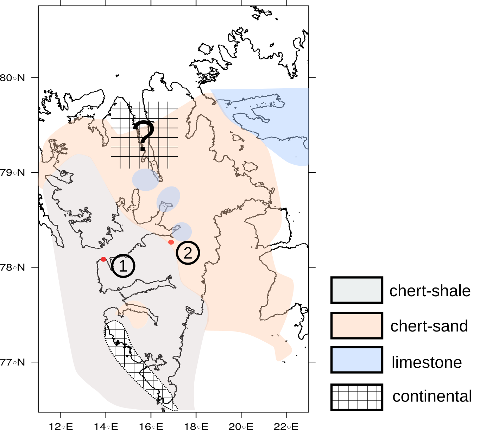
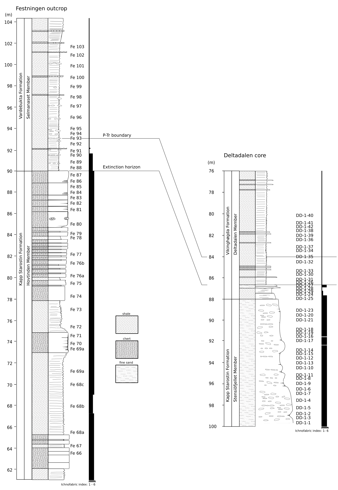
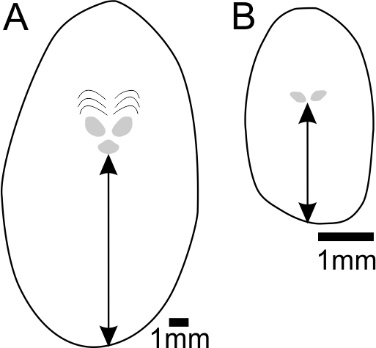

```{r setup, include=FALSE}
 
# default knitr options
knitr::opts_chunk$set(echo = FALSE, 
                      message = FALSE, 
                      warning = FALSE, 
                      dpi = 300, 
                      digits = 2)

# following code for loading and writing the bibtex references for the used 
# packages is adapted from the blog post: //www.r-bloggers.com/bibliography-with-knitr-cite-your-references-and-packages/,
# by Michael

# required packages
packages <- c("tidyverse", # plotting, datawrangling
              "gridExtra", # multiplot
              "marelac",   # geochemical database plug-in
              "readxl",    # reading xls workbooks
              "gtable",    # multiplot
              "bibtex",    # writing bibtex files
              "grid",      # drawing
              "knitr",     # for knitting rmarkdown files
              "png",       # read and write bitmap images
              "sp",        # spatial data
              "rgdal",     # geospatial data
              "rgeos",     # geometry engine
              "lattice"    # graphing 
              )    

# load packages
invisible(lapply(packages, library, character.only = TRUE))

# get the packages version 
packages_versions <- function(p) {
  paste(packageDescription(p)$Package, packageDescription(p)$Version, sep = " ")
}

# get the R reference
rref <- citation()

# create ref key
rref$key <- "rversion"

# write the R reference
write.bib(rref, "rversion.bib")

# get the packages references
write.bib(packages, "packages.bib")

# merge the mendeley references and the packages references
cat(paste("% Automatically generated", Sys.time()), "\n% DO NOT EDIT",
    { readLines("library.bib") %>% 
      paste(collapse = "\n") },
    { readLines("rversion.bib") %>% 
      paste(collapse = "\n") },
    { readLines("packages.bib") %>% 
      paste(collapse = "\n") },
    file = "biblio.bib",
    sep = "\n")

# R version has no key added
rref<- rref %>% 
  enframe() %>% 
  mutate(value = "@rversion")

data.path <- "/home/nicola/Documents/work/projects/Phosphor_project/report/spitsbergen/supplement/NatGeo/"

```


##### Page Break

This supplementary information files contains additional on the applied methods, data quality and additional discussion on the fidelity of the geochemical signals. Data as well as the R Markdown scripts for data processing, statistics and visualization are provided along with this document.


```{r}

# global identifier of datasets
gl.ID <- c("ID", "section", "section.ID")
# chemical data (QC values etc)
ls.Chem <- list()
# levels for phases
lv.ph <- c("Fe_mag", "Fe_ox", "CDB", "Det", "Fe_carb", "Fe_PRS", "Fe_py",
           "P_mag", "P_ox2", "P_ox1", "P_aut", "P_det", "P_org",
           "TOC",
           "d13C",
           "d34S",
           "Fe", "Al", "P", "Mo", "U", "Re")
# levels for methods
lv.mt <- c("Pspec", "Fespec", "CRS", "LECO", "EA", "EA-MS", "TD")

#===============================================================================
# elemental data
#===============================================================================

# sample labels and weights
ID  <- read_csv(paste0(data.path, "data/samplelist/SampleIDs.csv")) %>% 
          rename(section.ID = `section ID`)  

#-------------------------------
# loading Fe spec data
#-------------------------------
# list of Fe spec datafiles
ls.Fe <- list.files(path = paste0(data.path, "data/Fe_seq"), 
                    pattern = "_ed.csv")

all.Fe <- map_df(ls.Fe %>% set_names(), ~read_csv(file = 
                                                    paste0(data.path, 
                                                          "data/Fe_seq/", .x)),
                 .id = "path") %>%
            filter(str_detect(ID, "MS")) %>%
            mutate(phase = factor(
                             case_when(
                              str_detect(path, pattern = "AmOx") ~ "Fe_mag",
                              str_detect(path, pattern = "CDA")  ~ "Fe_ox",
                              str_detect(path, pattern = "CDB")  ~ "CDB",
                              str_detect(path, pattern = "Det")  ~ "Det",
                              str_detect(path, pattern = "NaAc") ~ "Fe_carb",
                              str_detect(path, pattern = "BH") ~ "Fe_PRS"
                                      ),
                             levels = lv.ph 
                                  )
                   ) %>%
            mutate(method = factor(
                              if_else(str_detect(path, pattern = "_P_"),
                                      "Pspec", "Fespec"),
                              level = lv.mt
                 ))

# seperate Fe sequentials of P speciation protocol
all.Fe.P <- all.Fe %>%
              filter(method == "Pspec")

# merge Fe spec data with sample IDs
all.Fe <- all.Fe %>%
            filter(method == "Fespec") %>%
            left_join( . , ID, by = "ID") %>%
# remove samples without section identifier
            drop_na(section.ID)

#-------------------------------
# loading CRS data
#-------------------------------
# list of CRS datafiles
ls.CRS <- list.files(path = paste0(data.path, "data/CRS"), pattern = ".csv")
all.CRS <- map_df(ls.CRS %>% 
                    set_names(), 
                  ~read_csv(file = paste0(data.path, "data/CRS/", .x)),
                  .id = "path")

#-------------------------------
# loading Total Digest (TD) data
#-------------------------------
all.TD <- list(
               read_csv(paste0(data.path, "data/totals/Total_Sum_ed.csv")) %>%
                  group_by(ID) %>%
                  mutate(newID = row_number()),
               read_csv(paste0(data.path, "data/totals/Total_Sum_TE_ed.csv")) %>%
                  group_by(ID) %>%
                  mutate(newID = row_number())
               ) %>%
            reduce(full_join, by = c("ID", "newID")) %>%
            left_join( . ,ID, by="ID") %>%
            select(-newID)

#-------------------------------
# loading P spec data
#-------------------------------
# list of P seq datafiles
ls.P <- list.files(path = paste0(data.path, "data/P_seq"), 
                   pattern = ".xls") %>%
         set_names()

# calibration curve labeller
cal.lab <- function(Label, D, dt) paste0("Calib_", Label, "_", D, "x_", dt )

all.P <- map_df(ls.P, ~read_xls(path = paste0(data.path, "data/P_seq/",.x)), 
                .id = "path") %>%
         mutate(path = case_when(
                             path == "AKKA_15022018.xls" ~  "jan2018",
                             path == "AKKA_19032018.xls" ~  "march2018",
                             path == "DD_03122017.xls" ~  "dec2017",
                             path == "Fest_30102017_ed.xls" ~  "oct2017")
                ) %>%
         rowwise() %>%
         mutate(Calib = cal.lab(Label, D, dt = path)) %>%
         ungroup()


# create unique labels for P seq data
P_labs <- all.P %>%
            group_by(ID) %>%
            arrange(ID) %>%
            distinct_at(vars(ID, section.ID, section, weight_gram)) %>%
            ungroup()

# list of calibration curves
ls.Clb <- map(ls.P, ~ excel_sheets(path = 
                                      paste0(data.path, "data/P_seq/", .x)), 
               id = ls.P) %>%
           map( . , ~ purrr::keep(.x, ~grepl("Calib", . )))

# January 2018
CBs_jan   <- map2(ls.P[1] , ls.Clb[[1]],  ~ 
                    read_xls(path = 
                               paste0(data.path, "data/P_seq/", .x), 
                             sheet = .y))
names(CBs_jan ) <- ls.Clb[[1]]
# March 2018
CBs_march <- map2(ls.P[2] , ls.Clb[[2]], ~ 
                    read_xls(path = paste0(data.path, "data/P_seq/", .x), 
                             sheet = .y))
names(CBs_march) <- ls.Clb[[2]]
# December 2017
CBs_dec   <- map2(ls.P[3] , ls.Clb[[3]],  ~ 
                    read_xls(path = paste0(data.path, "data/P_seq/", .x), 
                             sheet = .y))
names(CBs_dec) <- ls.Clb[[3]]
# October 2017
CBs_oct   <- map2(ls.P[4] , ls.Clb[[4]],  ~ 
                    read_xls(path = paste0(data.path, "data/P_seq/", .x), 
                             sheet = .y))
names(CBs_oct) <- ls.Clb[[4]]

# complete list of calibration curves
CBs.com <- flatten(list(CBs_dec, CBs_jan, CBs_march, CBs_oct))

#-------------------------------
# loading ICP P spec data
#-------------------------------
# list of ICP P seq datafiles
ls.ICP.P  <- list.files(path = paste0(data.path, "data/P_seq/ICP"), 
                        pattern = ".csv")

all.ICP.P <- map_df(ls.ICP.P %>% 
                      set_names(),
                    ~read_csv(file = paste0(data.path, "data/P_seq/ICP/", .x)),
                    .id = "path") %>%
              mutate(phase = factor(
                              case_when(
                                  str_detect(path, pattern = "AmOx") ~ "P_mag",
                                  str_detect(path, pattern = "CDA")  ~ "P_ox2",
                                  str_detect(path, pattern = "CDB")  ~ "P_ox1"
                                        ),
                              levels = lv.ph
                                   )
                     ) %>%
              mutate(unit = "%", 
                     method = factor("Pspec", levels = lv.mt)) %>%
              select(ID, value = ppm, phase, unit, method)

#-------------------------------
# loading TOC data
#-------------------------------
# Festningen
TOC_fest <-read_csv(paste0(data.path, "data/TOC/", "MS_TOC_sep2016.csv")) %>%
            select(ID = Name, value = Carbon)

# Deltadalen
TOC_dd <-read_csv(paste0(data.path, "data/TOC/", "MS_TOC_march2018.csv")) %>% 
          select(section.ID = Name, value = Carbon)

# sample labels TOC
ID_TOC <- read_csv(paste0(data.path, "data/samplelist/SampleIDs_TOC.csv")) 

# merge with sample identifiers
TOC_fest <- full_join(TOC_fest, ID_TOC, by="ID") %>%
              filter(section=="Festningen") %>%
              mutate(method = factor("LECO", levels = lv.mt))
TOC_dd <- full_join(TOC_dd, ID_TOC  , by="section.ID") %>%
             filter(section=="Deltadalen")%>%
             mutate(method = factor("EA", levels = lv.mt))

# combine TOC Festningen (LECO) with Deltadalen (EA)
all.TOC <- bind_rows(TOC_fest, TOC_dd)

# correct TOC for weight loss during acid digestion
all.TOC <- all.TOC %>% 
            mutate(value = ((1 - ((weight_tube_gram +
                                   weight_samples_gram) -
                                   weight_after_gram) /
                                   weight_samples_gram) * value),
                    phase = factor("TOC", levels = lv.ph),
                    unit = "%") %>%
            select(gl.ID, phase, method, value, unit) %>%
            drop_na()

```


```{r}

#===============================================================================
# isotope data 
#===============================================================================

#-------------------------------
# loading d13C data
#-------------------------------
all.d13C   <- read_csv(paste0(data.path, 
                              "data/Cisotope/d13C_march2018_ed.csv")) %>%
                        mutate(section = if_else(str_detect(section.ID, "DD"),
                                                 "Deltadalen", "Festningen"),
                               phase = factor("d13C", levels = lv.ph),
                               method = factor("EA-MS", levels = lv.mt),
                               value = d13C,
                               unit = "\u2030") %>%
                        select(-d13C)

#-------------------------------
# loading d34S data
#-------------------------------

d34S_fest <- read.csv(paste0(data.path, "data/Sisotope/d34S_Fest.csv"),
                      stringsAsFactors = FALSE) %>% as_tibble()
d34S_DD <- read_csv(paste0(data.path, "data/Sisotope/d34S_DD.csv"))

# function for name reformatting
stringy<-function(x) {
      
  cm <- strsplit(x, split = "-") 
  
  return(cm[[1]][2])
  }

# reformatting raw data output (only Festningen)
d34S_fest <- d34S_fest %>% 
               select(SN = contains(".Number"),
                      Aq.T = contains("date"),
                      Name,
                      RT = contains("Sec"),
                      Amps = contains("..nA"),
                      S34) %>%
               rowwise() %>%
               mutate(Name = stringy(Name)) %>%
               mutate(section =
                        case_when(
                                  str_detect(Name, pattern = "Fe") ~ "sample",
                                  str_detect(Name, pattern = "blank") ~ "blank",
                                  str_detect(Name, pattern = "S3") ~ "standard",
                                  str_detect(Name, pattern = "CP") ~ "standard",
                                  str_detect(Name, pattern = "May") ~ "standard",
                                  str_detect(Name, pattern = "sws") ~ "standard"
                                 )
                      ) %>%
                ungroup() %>%
                drop_na()
                           
# create labels for sampling blocks
 d34S_bl <- d34S_fest %>% 
              distinct(SN, .keep_all = TRUE) %>%
              filter(!section == "blank") %>%
              mutate(rn = row_number()) %>%
              group_by(section) %>%
              mutate(block = dense_rank(cumprod
                                         (rn - lag(rn,
                                                   default =
                                                             min(rn) - 1)))
                                  ) %>% 
              ungroup %>%  
              select(SN, block)
 
# add sampling blocks to datafile
d34S_fest <- left_join(d34S_fest, d34S_bl, by = "SN")

d34S_fest <- d34S_fest %>%
# exclusion of data with wrong retention time (~300 sec is appropriate)
# exclusion of data with too low and too high intensity (Amp)
               filter(RT > 295 & RT < 305,Amps > 0.9 & Amps < 4) %>%
               group_by(Name, block) %>%
# selection of the second duplo if avalaible to prevent signal smearing
               top_n(1, SN) %>%
               ungroup()

# assigned values S reference material
ls.Chem$Sref   <- tibble(Name = c("S3", "CP", "sws"), 
                         real = c(-32.06, -4.56, 20.3))

# function to check for scale compression
scale.checker <- function(x){
                             if(min(x, na.rm = TRUE) < 0.95){
                               print("scale compression exceeded")
                             }else{
                               print("all good! no scale compression")
                             }}
                                  
# include measured S reference isotope values
ls.Chem$S.c <- ls.Chem$Sref %>% 
                 mutate(diff.real = real - lag(real)) %>% 
                 left_join( . , d34S_fest %>% 
                   filter(section == "standard") %>% 
                     group_by(Name) %>% 
                     summarise (sample = mean(S34)), by = "Name") %>% 
                     mutate(diff.sample = sample - lag(sample)) %>% 
                     rowwise() %>% 
                     mutate(scale.C = diff.sample / diff.real)  %>% 
                     ungroup()

# checking for scale compression
# scale.checker(ls.Chem$S.c$scale.C)

# calibration of S isotope values (only for Festningen)
mod_fun <- function(df) {lm(real ~ S34, df)}
s_fun <- function(mod) {coefficients(mod)[[2]]}
i_fun <- function(mod) {coefficients(mod)[[1]]} 

d34S_fest <- d34S_fest %>% 
               group_by(block) %>% 
               filter(section == "standard") %>%
               left_join(ls.Chem$Sref, by = "Name") %>%  
                 drop_na() %>% 
                 nest() %>%  
# linear regression for calibration of d34S
                 mutate(model = map(data, mod_fun)) %>% 
# extraction of coefficients and merge with m.blocks
                 mutate(slope = map_dbl(model, s_fun), 
                        int = map_dbl(model, i_fun)) %>% 
                 select(block, slope, int) %>% 
                 left_join(d34S_fest, . , by = "block") %>% 
                   rowwise() %>% 
                   mutate (S34 = S34 * slope + int) %>% 
                   ungroup()


all.d34S <- bind_rows(d34S_fest %>% 
                      filter(section == "sample") , 
                      d34S_DD) %>% 
              mutate(section = if_else(str_detect(Name, "Fe"), 
                                       "Festningen", 
                                       "Deltadalen"),
                     phase = factor("d34S", levels = lv.ph), 
                     method = factor("EA-MS", levels = lv.mt), 
                     unit = "\u2030") %>% 
              select(section.ID = Name, 
                     section, 
                     phase, 
                     method, 
                     value = S34, 
                     unit)

```


```{r}

#===============================================================================
# Data transformation function
#===============================================================================

# function describing the formulation used to derive the rock element 
# concentration (wt. %), requiring the machine output (solution unit), 
# solution volume (ml) and sample weight (g).

EWeight <- function(Output, Output.unit = "ppm", Volume, Weight){ 
                        
                        if(Output.unit == "ppm"){unit <- 10^-4}
                        if(Output.unit == "ppb"){unit <- 10^-7}
                        if(Output.unit == "ppt"){unit <- 10^-10}
                                                          
                      (Output * unit * Volume) / Weight 
}

```


```{r}

#===============================================================================
# Fe sequential data
#===============================================================================
# Fe spec conversion to rock sample concentration     
all.Fe <- all.Fe %>%
            rowwise() %>% 
            mutate(value = EWeight(ppm, Output.unit = "ppm", V, weight_gram)) %>%
            ungroup() %>% 
            select(-c(Abs, RSD, V, weight_gram, ppm)) %>% 
            mutate(unit = "%")

#---------------------------
# QCs
#---------------------------
# reject in-house standard HN22, as n = 1
remove <- c("HN22")
all.Fe <- all.Fe %>% 
            filter(!section.ID %in% remove)

# store QCs Fe spec
all.QC <- all.Fe %>% 
            filter(section == "Standard")
#---------------------------
# duplicates 
#---------------------------
# storing duplicates
dups.Fe <- all.Fe %>% 
             group_by(phase, section.ID) %>%
             filter(n() > 1 & !section == "Standard") %>%
              summarise(value = mean(value), 
                        method = unique(method), 
                        section = unique(section)) %>% 
              drop_na() %>% 
              ungroup()

# take mean values for duplicates
all.Fe <- all.Fe %>% 
            group_by(phase, section.ID) %>%
            filter(n() < 2 & !section == "Standard") %>% 
            bind_rows( . , dups.Fe) %>% 
            select(gl.ID, height, phase, method, value, unit) %>% 
            ungroup()

#===============================================================================                    
# function describing the conversion which is used to derive the CRS-bound Fe 
# concentration (wt.%), requiring weight of the Ag2S precipitate (g) and the 
# initial sample weight (g)
#===============================================================================   
CRSWeight <- function(AG2S, Weight){(AG2S * 0.129 * 0.871 * 100) / Weight}

# CRS conversion to rock sample concentration, and join
all.Fe <-  all.CRS %>% 
             rowwise %>% 
             mutate(value = CRSWeight((Weight_final - Weight_filter), 
                                      Weight_gram)) %>% 
             ungroup() %>% 
             right_join( . , all.Fe %>% 
                              filter(phase == "Fe_mag") %>% 
                              select(gl.ID, height), 
                        by = "section.ID") %>% 
               mutate(unit = "%", 
                      phase = factor("Fe_py", levels = lv.ph), 
                      method = factor("CRS", levels = lv.mt)
                      ) %>% 
               select(gl.ID, height, phase, method, value, unit) %>% 
               bind_rows(all.Fe)
           
```


```{r}

#===============================================================================
# P sequential data
#===============================================================================
# function for P spec conversion to rock sample concentration 
AbCalib <- function(Absorb, C_lab, Calib){

   CTA <- lm(ppm ~ A, pluck(Calib, C_lab))

   TA <- CTA$coefficients[2] * Absorb + CTA$coefficients[1]

}

# P spec from photospectrometer conversion to rock sample concentration  
all.P <- all.P %>% 
            rowwise() %>% 
            mutate(value = EWeight(AbCalib(Absorb = A, 
                                           C_lab = Calib, 
                                           Calib = CBs.com), 
                                    "ppm", 
                                    V, 
                                    weight_gram)
                   ) %>%
            mutate(phase = factor(
                                case_when(
                                         str_detect(Label, "CDB") ~ "P_ox1",
                                         str_detect(Label, "CDA") ~ "P_ox2",
                                         str_detect(Label, "NaAc") ~ "P_aut",
                                         str_detect(Label, "HCl1") ~ "P_det",
                                         str_detect(Label, "AmOx") ~ "P_mag",
                                         str_detect(Label, "HCl2") ~ "P_org"
                                         ),
                                levels = lv.ph
                                  )
                   ) %>%
            ungroup() %>% 
            mutate(unit = "%", 
                   method = factor("Pspec", levels = lv.mt)) %>% 
            select(gl.ID, value, unit, method, weight_gram, Label, phase)
            
all.P <- all.ICP.P %>%  
          left_join( . , all.P %>% 
                           filter(Label == "CDB_MgCl") %>%  
                           select(gl.ID, weight_gram), 
                     by = "ID") %>% 
           rowwise() %>% 
           mutate(value = EWeight(value, "ppm", 10, weight_gram)) %>% 
           ungroup() %>%
           bind_rows(. , all.P %>% 
                       select(-Label)) %>% 
           group_by(phase, ID, section.ID, section, unit,  method) %>% 
           summarise(value = sum(value)) %>% 
           ungroup() %>%
           select(gl.ID, phase, method, value, unit)

#---------------------------             
# QCs P spec
#---------------------------
all.QC <- all.P %>% 
           filter(section == "Standard") %>% 
           bind_rows( . , all.QC)

# remove QCs P spec
all.P <- all.P %>% 
          filter(!section == "Standard" & 
                 !section == "Standard_test")             
  
```


```{r}

#===============================================================================
# Total Digestion
#===============================================================================
# element of importance for this work
TD.sc <- list(major = c("Fe", "Al", "P"), 
              minor = c("Mo", "U"), 
              ultra = "Re")

# converting TD elements to rock sample concentration
all.TD <- all.TD %>% 
            select(one_of(c(gl.ID, "height", unlist(TD.sc), "weight_gram"))) %>% 
            gather(key = "phase", value = "value", 
                   -c(gl.ID, "weight_gram", "height")
                   ) %>% 
            mutate(phase = factor(phase, levels = lv.ph)) %>% 
            mutate(Output.unit = 
                            case_when(
                                      phase %in% TD.sc$major ~ "ppm",
                                      phase %in% TD.sc$minor ~ "ppb",
                                      phase %in% TD.sc$ultra ~ "ppt"
                                     )
                   ) %>% 
            rowwise() %>% 
# calculating actual concentration,converting units to ppm for TE (ppb for Re)
            mutate(value = case_when(Output.unit == "ppm"~ 
                                     EWeight(value, Output.unit, 250, 
                                             weight_gram),
                                     Output.unit == "ppb" ~
                                     EWeight(value, Output.unit, 250, 
                                             weight_gram)*10^4,
                                     Output.unit == "ppt" ~
                                     EWeight(value, Output.unit, 250, 
                                            weight_gram)*10^7
                                    )
                   ) %>% 
          ungroup() %>% 
  # actual units of element rock concentration
          mutate(unit = case_when(Output.unit == "ppm" ~ "%",
                                  Output.unit == "ppb" ~ "ppm",
                                  Output.unit == "ppt" ~ "ppb")) %>% 
          mutate(method = factor("TD", levels = lv.mt)) %>% 
          select(gl.ID, height, phase, method, value, unit, weight_gram)
          
# two samples with wrong volume solution 10ml HCl instead of 5ml HCl
wr.S <- c("MS_TD_65","MS_TD_66")

all.TD <- all.TD %>%  
            rowwise() %>% 
            mutate(value = if_else(ID %in% wr.S, value * 2, value)) %>% 
            ungroup()

# remove heigh and low initial weight standards for testing weight dependence
all.TD <- all.TD %>% 
            filter(!section == "Standard" && weight_gram < 0.15 && 
                   weight_gram > 0.07) %>% 
            select(-weight_gram)

#---------------------------
# store QCs TD
#---------------------------
all.QC <- all.TD %>% 
            filter(section == "Standard") %>% 
            bind_rows( . , all.QC) 

# remove QCs TD
all.TD <- all.TD %>% 
            filter(!section == "Standard" & !section == "blank") 
                                 
```


# Geological setting

The Svalbard island group is situated between 74 and 81$\,$°N on the northwestern part of the Barents Shelf (Supplementary Fig \@ref(fig:FigGeograph)). During Permian time the area was part of an extensive shelf on the northwestern margin of Pangaea situated at a palaeolatitude of ~40--45$\,$°N (Supplementary Fig \@ref(fig:FigPaleoGeo)). A fold-and-thrust belt, ranging over more than 300$\,$km, exposes Palaeozoic, Mesozoic and Cenozoic strata along the west coast of the main island (Spitsbergen) from the Brøgger peninsula in the North to the Sørkapp in the southernmost tip. The Festningen site (78.09$\,$°N, 13.88\,$°$E) on  the southern entrance of the Isfjorden (Western Nordenskiöld Land) is an easily accessible and frequently studied stratigraphic profile. At this site strata dips at a ~45$\,$° angle in a eastward direction as part of the short limb of a NNW--SSE-striking assymetric syncline [@Harland1997; @Grasby2015a]. The coastal cliffs of the Festningen site extend in an E-W direction providing an easy accessible opportunity to traverse the strata. A second P--Tr stratigraphic sequence at Deltadalen (78.27$\,$°N, 16.88$\,$°E) was drilled south of the coast of the Sassenfjorden/Tempelfjorden. Here Permian and Triassic strata are relatively flat-lying with only minor folds and thrusts[@Mork1999].  


```{r eval=FALSE}

setwd(paste0(data.path, "data/Geograph"))

shape2 <-readOGR(dsn = ".", layer = "SJM_adm1") # loading shape file

plot(shape2)

# retrieving the Coordinate Reference System (CRS), 
# which is the Global Model and Flattening Function.

common.CRS2 <-CRS(proj4string(shape2))

# the coordinates for the Festningen site 15 E and 78 N

Fest.x <- 13.88 # longitude
Fest.y <- 78.09 # latitude

# the coordinates for the Festningen site 15 E and 78 N

DD.x <- 16.88 # longitude
DD.y <- 78.27 # latitude

Loc.coord <- data.frame(name = "Sites", 
                        x = c(Fest.x, DD.x), 
                        y = c(Fest.y, DD.y))
coordinates(Loc.coord) <- c("x", "y")

# mock CRS to override the NA 
proj4string(Loc.coord) <- CRS("+proj=longlat +ellps=WGS84") 

# transform coordinate system to fit map
Loc.coord <- spTransform(Loc.coord, common.CRS2) 

## Clip the map
out <- raster::crop(shape2, extent(11, 23, 75, 81))

spits <- spplot(out, "ID_0",  colorkey = FALSE,
                scales = list(draw = TRUE),
                fill = "white",
                sp.layout = c('sp.points', Loc.coord , 
                              col = 'red', pch = 16),
                par.settings = list(panel.background = 
                                      list(col = 'transparent')),
                add = TRUE)

trellis.device(pdf, file = "geograph_new.pdf")
print(spits)
dev.off()

```


```{r FigGeograph,  anchor="figure", fig.cap = "Geographical setting of the Festningen section (1) and Deltadalen core (2). Lithofacies of Spitsbergen after ref @Harland1997. Base map from GADM database (<https://gadm.org/>)"}



```


```{r eval=FALSE}

#paleolatitude by creating a shapefile and cookycutting in Gplates

# create LIPS from Johansson et al 2018
LIP <- readOGR(paste0(
                  data.path, 
                    "data/Geograph/Johansson_etal_2018_EarthByte_LIPs_v2.shp"))


# subset spatial object according to attribute 'NAME'
LIP <-subset(LIP, NAME ==  "SIBERIAN TRAPS, EXTRUSIVE VOLCANICS")

# creating modified LIP shapefile
dir.create("data/Geograph/LIPs")
writeOGR(obj = LIP, dsn = "LIPs", layer = "newLIP", driver = "ESRI Shapefile")

# defining a location ordinary matrix for the locations
coords.locs <-cbind(POINT.X = c(13.88,16.88), POINT.Y = c(78.07, 78.27) )

# defining a location spatialpoint for the location
coords.locs.points <- SpatialPoints(coords.locs)

# coordinate reference system
geo.crs <-  CRS("+init=epsg:4326") # WGS84 lat-long projection)
proj4string(coords.locs.points) <- geo.crs

# spatialpointdataframe
attr <- data.frame(name = c("Festningen", "Deltadalen"), 
                   MA_MAX = rep(253,2), 
                   MA_MIN = rep(0,2)) 

coords.locs.dpoints <- SpatialPointsDataFrame(coords.locs.points,attr)

setwd(paste0(data.path, "data/Geograph/coords")
writeOGR(obj = coords.locs.dpoints, 
         dsn = "coords", 
         layer = "coord.locs", 
         driver = "ESRI Shapefile")

```


```{r FigPaleoGeo,  anchor="figure", fig.cap="Palaeogeographic reconstruction including the location of the sampled localities (circle in inset) and the Siberian Traps Basalts (yellow area, after ref. @Johansson2018). Reconstruction with GPlates (<https://www.gplates.org>) and after refs. @Matthews2016 and @Seton2012."}


# create gtable
gg <- gtable(widths =  unit(1, "null"), heights = unit(1, "null"))

img <- readPNG(paste0(data.path, "data/Geograph/image_250.00Ma.png"))
a <- rasterGrob(img)

img <- readPNG(paste0(data.path, "data/Geograph/image_250.00Ma_Z.png"))
b <- rasterGrob(img, width = unit(0.3, "npc"), 
                x =  unit(0.85, "npc"), 
                y =  unit(0.78, "npc"))

# assign element to gtable
rect.1  <-  grid.rect(width = unit(0.17, "npc"), 
                      height = unit(0.20, "npc"),  
                      x = unit(0.5, "npc"), 
                      y = unit(0.66, "npc"), 
                      gp = gpar(fill = FALSE, col = "black", ltw = 2), 
                      draw = FALSE) # black rect in main figure

rect.2  <-  grid.rect(width = unit(0.295, "npc"), 
                      height = unit(0.43, "npc"),  
                      x = unit(0.835, "npc"), 
                      y = unit(0.775, "npc"), 
                      gp = gpar(fill = "white", col = "white", ltw = 2), 
                      draw = FALSE) # white background of inset

rect.3  <-  grid.rect(width = unit(0.298, "npc"), 
                      height = unit(0.38, "npc"),  
                      x = unit(0.85, "npc"), 
                      y = unit(0.78, "npc"), 
                      gp = gpar(fill = FALSE, col = "black", ltw = 3), 
                      draw = FALSE) # black rect around inset

# creating elements and text to be drawn on map
text.1  <-  grid.text(label = "Panthalassa",  
                      x = unit(0.26, "npc"), 
                      y = unit(0.7, "npc"), 
                      gp = gpar(fontsize = 7), 
                      draw = FALSE)
text.2  <-  grid.text(label = "Pangaea",  
                      x = unit(0.95, "npc"), 
                      y = unit(0.79, "npc"), 
                      rot = 25, 
                      gp = gpar(fontsize = 7), draw = FALSE)
text.3  <-  grid.text(label = "Barents \n Sea",  
                      x = unit(0.885, "npc"), 
                      y = unit(0.845 , "npc"), 
                      rot = -15, 
                      gp = gpar(fontsize = 5), 
                      draw = FALSE)
text.4  <-  grid.text(label = "Sverdrup \n Basin",  
                      x= unit(0.81, "npc"), 
                      y=unit(0.83, "npc"), 
                      rot = -25, 
                      gp = gpar(fontsize = 5), 
                      draw = FALSE)
text.5  <-  grid.text(label = "Siberian Traps",  
                      x = unit(0.9, "npc"), 
                      y = unit(0.94, "npc"), 
                      rot = 15, 
                      gp = gpar(fontsize = 5), 
                      draw = FALSE)
text.6  <-  grid.text(label= "Permian–Triassic (251.9 Mya)",  
                      x = unit(0.2, "npc"), 
                      y = unit(0.94, "npc"),  
                      gp = gpar(fontsize = 7), 
                      draw = FALSE)
circ.1 <-  grid.circle(r = unit(0.012, "npc"), 
                       x = unit(0.855, "npc"), 
                       y = unit(0.805,"npc"), 
                       gp = gpar(fill = FALSE, col = "black", ltw = 2), 
                       draw = FALSE)

gg <- gtable_add_grob(gg, a, 1, 1, z=1, name="a")
gg <- gtable_add_grob(gg, rect.1, 1, 1, z=2, name="a.lab.rec")
gg <- gtable_add_grob(gg, rect.2, 1, 1, z=3, name="b.lab.rec")
gg <- gtable_add_grob(gg, b, 1, 1, z=4, name="b")
gg <- gtable_add_grob(gg, rect.3, 1, 1, z=5, name="lab.rec")
gg <- gtable_add_grob(gg, circ.1, 1, 1, z=6, name="lab.circ")

gg <- gtable_add_grob(gg, text.1, 1, 1, z=Inf, name="Panthalassa")
gg <- gtable_add_grob(gg, text.2, 1, 1, z=Inf, name="Pangaea")
gg <- gtable_add_grob(gg, text.3, 1, 1, z=Inf, name="Barents")
gg <- gtable_add_grob(gg, text.4, 1, 1, z=Inf, name="Sverdrup")
gg <- gtable_add_grob(gg, text.5, 1, 1, z=Inf, name="Traps")
gg <- gtable_add_grob(gg, text.6, 1, 1, z=Inf, name="PTr")

# drawing the geographic map of Spitsbergen with associated elements
grid.draw(gg)

# save plots external
ggsave(paste0(data.path, "figures/SuppFig2.tiff"), gg)

```


# Lithostratigraphy and facies description

The Kapp Starostin Formation is dominated by biogenic cherts (spiculites) with subordinate cherty mudstones, brachiopod and bryozoan-rich limestones and glauconitic sandstones[@Blomeier2013; @Dustira2013, @Bond2015, @Zuchuat]. Although substantial differences between the lithologies of outer Isfjorden of western-most Spitsbergen (Festningen) and inner Isfjorden of central Spitsbergen (Deltadalen), which has led to the proposal of two distinct members; the Hovtinden and Stensiöfjellet members, respectively, these units grade laterally into each other (Supplementary Fig \@ref(fig:FigLithostrat))[@Blomeier2013] and can therefore be correlated.  These two lithologies are interpreted to record shallow marine, high energy conditions in the inner Isfjorden (Stensiöfjellet Member)[@Zuchuat] whilst dark shales and cherts dominated in more distal, deeper locations (Hovtinden Member) that occurred in the outer Isfjorden[@Blomeier2013; @Bond2017]. Our study section at Festningen comprises the most expanded development of the Kapp Starostin Formation and has relatively thin beds of limestone indicating its distal, deep water development compared to the more easterly Deltadalen site. This sand-rich site was probably part of the inner sandy shelf that developed in north and east Spitsbergen in the Permian (Supplementary Fig \@ref(fig:FigGeograph)).


```{r  FigLithostrat,  anchor="figure", out.width="80%", fig.cap="Detailed lithology logs of the Deltadalen core and Festningen outcrop as well as a correlation scheme linking both sections. Location of the Permian--Triassic after ref @Zuchuat."}



```


During the Early Triassic the west-to-east thinning of the stratigraphy persisted although the facies became dominated by fine-grained clastic material (of the Vardebukta and  Vikinghøgda formations in the outer and inner Isfjorden, respectively) following the demise of siliceous sponges[@Wignall2016; @Foster2017]. However, glauconitic sandstones persist 1.5$\,$m above the the base of the Vikinghøgda Formation but the lithology is different from the underlying unit as it lacks diagenetic chert nodules (Supplementary Fig \@ref(fig:FigLithostrat))[@Mork1999; @Nabbefeld2010; @Foster2017; @Zuchuat]. Although some signs of condensation exist in the upper meter of the Kapp Starostin Formation at Deltadalen,  there are no erosive surfaces, and so no significant gaps are present in the studied sequences[@Wignall1996; @Zuchuat]. The deposition of these units occurred in an open-marine shelf setting[@Mork1999]. Initially, during the P--Tr boundary interval, deepest-water facies continued to be developed in the Festningen area. Progradation of sandy shoreface facies from a sediment source to the west saw shallower water conditions developed in this area later in the Early Triassic[@Wignall2016]. 

# Chronology

The uppermost beds of the Kapp Starostin Formation are of Late Permian age, where the whole lithological unit (~380$\,$m at Festningen) comprises a long time interval (Artinskian--Changhsingian), based on bryozoa, foraminifera, conodont, and brachiopod biostratigraphy as well as $\delta$^13^C chemostratigraphy[@Nakrem1992; @Dustira2013; @Blomeier2013; @Bond2017]. The abrupt lithological shift at the formation boundary has been interpreted as the die-off of a prolific silica producing metazoan community (sponges)(Supplementary Fig \@ref(fig:FigLithostrat)), and also contains the disappearance of deep-tiered ichno fossil *Zoophycos*, which is synchronous with the global-scale biotic crisis[@Wignall1996]. Although faint signs of life persist in the form of bioturbation in the shale facies up to a height of ~3$\,$m above the base of the Vardebukta Formation at Festningen (Supplementary Fig \@ref(fig:FigLithostrat)), whereafter burrows disappear and sediments become finely laminated. A glauconitic sandstone unit, occurring above the base of the Vikinghøgda Formation (Supplementary Fig \@ref(fig:FigLithostrat)) and contains a diverse ichno fabric assemblage (see Supplementary section 7.1.2) and, as such, the extinction horizon is placed above this unit[@Foster2017]. Occurrences of the ammonite *Otoceras boreale* and species of the bivalve *Claraia*, 4--10$\,$m above the base of the Vardebukta and Vikinghøgda formations are age-diagnostic fossils for the Griesbachian (earliest Triassic)[@Harland1997; @Wignall1996; @Mork1999; @Nakrem2008; @Zuchuat]. Furthermore, at Deltadalen the marker conodont species *Hindeodus parvus* that defines the P--Tr boundary worldwide has recently been uncovered[@Zuchuat]. Based on these considerations, a latest Permian age has been inferred for the shale and sandstone units above the formational boundary of Festningen and Deltadalen, respectively[@Wignall1996; @Dustira2013; @Nabbefeld2010; @Foster2017; @Zuchuat]. Carbon isotope based chemostratigraphy offers an alternative refined age control, where P--Tr event beds worldwide record a long-term negative $\delta$^13^C anomaly that relates to a perturbation of the global biogeochemical carbon cycle[@Korte2010]. Based on this premise, the $\delta$^13^C~org~ minimum has been used as an alternative stratigraphic marker for P--Tr boundary sequence at Festningen, which have so far not yielded the marker conodont species *H. parvus*[@Wignall1998; @Grasby2015a]. Adopting this approach helped define the position of the P--Tr boundary in both sequences (Fig. 1 and Supplementary Fig \@ref(fig:FigLithostrat)), and suggests that the successions record an age range of roughly Changhsingian to earliest Triassic.

# Materials

The Festningen section was sampled at approximately one meter intervals during a sampling campaign in July 2012. The Deltadalen core was recovered during an expedition in 2014 and the core is currently deposited at the University of Oslo. Samples were taken at a 0.5$\,$m resolution from the lowest 20$\,$m of the core. The outcrop samples from Festningen were sawn in pieces and weathered surfaces were discarded along with material showing diagenetic textures. In turn, the samples were crushed manually and, depending on the samples size, either ground with a mechanical agate mill or an agate pestle and mortar.

# Data processing, statistics and visualization

This work was generated with the aid of Rmarkdown (*knitr*)[@knitr1; @knitr2; @knitr3] on the programming platform R[@rversion] and data processing and visualization was aided by the R packages: *tidyverse* [@tidyverse], *gtable* [@gtable], *png* [@png], *gridExtra* [@gridExtra], *readxl* [@readxl], *bibtex* [@bibtex], *sp* [@sp1; @sp2], *rgdal* [@rgdal], *rgeos* [@rgeos], *lattice* [@lattice], and *grid* [@rversion]. The library *marelac* [@marelac] was used for chemical data transformations[^r_version].


[^r_version]: `r version$version.string`, with: `r paste(lapply(sort(packages), packages_versions), collapse = ", ")`.

```{r}

# data output in wide format
all.CD.long <- list(all.TD,
                    all.Fe,
                    all.P, 
                    all.TOC, 
                    all.d13C, 
                    all.d34S) %>% 
                      reduce(bind_rows) %>% 
                        select(-height) %>% 
                        left_join(all.TD %>% 
                                    filter(phase == "Fe") %>%  
                                    select(section.ID, height), 
                                  by = "section.ID") %>% 
                          mutate(height = height / 100) %>% 
                          filter(section != "Akkamori") 
                    
all.CD.wide <- all.CD.long %>%   
                 select(-c(method, ID, unit)) %>% 
                 group_by(phase, section.ID) %>% 
                 spread(phase, value) %>% 
                 ungroup()


#===============================================================================
# complete datasets for publication
#===============================================================================

good <- c(section.ID = "section ID", section = "section", height = "height (m)", 
          P = "P[tot](wt. %)", Al = "Al[tot](wt. %)", Fe = "Fe[tot](wt. %)", 
          Mo = "Mo[tot](µg/g)", Re = "Re[tot](ng/g)", 
          U = "U[tot](µg/g)", Fe_carb = "Fe[carb](wt. %)", 
          Fe_ox = "Fe[ox](wt. %)",  Fe_mag = "Fe[mag](wt. %)", 
          Fe_py = "Fe[py](wt. %)", Fe_PRS = "Fe[PR](wt. %)", 
          P_ox1 = "P[ox1](wt. %)", P_ox2 = "P[ox2](wt. %)", 
          P_aut = "P[aut](wt. %)", P_det = "P[det](wt. %)", 
          P_mag = "P[mag](wt. %)", P_org = "P[org](wt. %)",
          TOC = "TOC(wt. %)", d13C = "δ13C[TOC]", d34S = "δ34S[py]")  

# save all the different files for each of the sections
df.extr <- all.CD.wide  %>%  
             group_by(section) %>% 
             arrange_at(vars(section, contains("height")), desc) %>% 
# rename columns  
             select(one_of(names(good))) %>% 
             rename_at(vars(names(good)), ~ good) %>% 
# round to appropriate decimal for different measurements
             mutate_at(vars(one_of(c("P[ox1](wt. %)", "P[ox2](wt. %)",
                                     "P[aut](wt. %)", "P[det](wt. %)", 
                                     "P[mag](wt. %)", "P[org](wt. %)"))), 
                       ~(sprintf("%.4f", . ))) %>% 
             mutate_at(vars(one_of(c("Fe[carb](wt. %)", "Fe[ox](wt. %)", 
                                     "Fe[mag](wt. %)", "Fe[py](wt. %)", 
                                     "Fe[PR](wt. %)"))), 
                       ~(sprintf("%.3f", . ))) %>% 
             mutate_at(vars(one_of(c("height (m)", "P[tot](wt. %)", 
                                     "Al[tot](wt. %)", "Fe[tot](wt. %)", 
                                     "Mo[tot](µg/g)", "Re[tot](ng/g)" , 
                                     "U[tot](µg/g)", "TOC(wt. %)"))), 
                       ~(sprintf("%.2f", . ))) %>% 
             mutate_at(vars(one_of(c("δ13C[TOC]", "δ34S[py]"))), 
                       ~(sprintf("%.1f", . ))) %>% 
             nest() 

# function to write files with accompanying filenames
fl.create <-function(df, name){
                                
                               df <- df %>% 
                                      drop_na()  
                               fl.names <- paste(name,"csv", sep = ".")  
                               write.table(x = df , 
                                           file = 
                                           paste0(data.path, 
                                             "datafiles/", 
                                                fl.names) , 
                                           append = FALSE, sep = ";", 
                                           row.names = FALSE, 
                                           fileEncoding = "UTF-8", 
                                           quote = FALSE)
                              }
# print data
walk2(df.extr %>% 
        pull(data) , 
      df.extr %>% 
        pull(section), 
      fl.create)            

#---------------------------------
# Standards totals
#---------------------------------

all.QC.wide <- all.QC %>%   
                 select(-c(unit, path, section, height)) %>% 
                 group_by(phase, ID) %>% 
                 spread(phase, value) %>% 
                 group_by(method) %>% 
                 arrange_at(vars(method, ID), desc) 

# filter to contain only reported QC
good <- good[names(good) %in% colnames(all.QC.wide)]

# rename columns  
all.QC.wide <- all.QC.wide %>% 
                select(method, one_of(names(good))) %>% 
                rename_at(vars(names(good)), ~ good) %>% 
# round to appropriate decimal for different measurements
                mutate_at(vars(one_of(c("P[ox1](wt. %)", "P[ox2](wt. %)",
                                   "P[aut](wt. %)", "P[det](wt. %)", 
                                   "P[mag](wt. %)", "P[org](wt. %)"))), 
                          ~(sprintf("%.4f", . ))) %>% 
                mutate_at(vars(one_of(c("Fe[carb](wt. %)", "Fe[ox](wt. %)", 
                                   "Fe[mag](wt. %)",  
                                   "Fe[PR](wt. %)"))), 
                          ~(sprintf("%.3f", . ))) %>% 
                mutate_at(vars(one_of(c("P[tot](wt. %)", 
                                   "Al[tot](wt. %)", "Fe[tot](wt. %)", 
                                   "Mo[tot](µg/g)", "Re[tot](ng/g)" , 
                                   "U[tot](µg/g)"))), 
                           ~(sprintf("%.2f", . ))) %>% 
                nest() 
              
# print QC data
walk2(all.QC.wide %>% 
        pull(data), 
      all.QC.wide %>% 
        pull(method), 
      fl.create)   

```


```{r, include=FALSE}

#===============================================================================
# normalization and redox proxies
#===============================================================================

#-------------------------------------------
# function for creating FeHR/FeT star
HR_star <- function(X, FeT, Fe_HR, base = 0.38){
                    
                      if(is.na(X) == TRUE){out <- NA }else{
                      if(X > base){out <- Fe_HR + ((X - base) * FeT) }else{
                                   out <- Fe_HR}
                                  }
                      return(out)
                                               }
#-------------------------------------------

plot.els <- list()

#-------------------------------------------
# Fe spec
#-------------------------------------------

all.CD.wide <- all.CD.wide %>% 
# highly reactive Fe pool  
          mutate(Fe_HR  = Fe_carb + Fe_ox + Fe_mag + Fe_py,    
# poorly reactive Fe pool  
          Fe_PRS = Fe_PRS - (Fe_carb + Fe_ox + Fe_mag)) %>%                   
# highly reactive Fe over total        
          mutate(HR_FeT = Fe_HR / Fe,                                
# poorly reactive Fe over total          
          PRS_FeT = Fe_PRS / Fe, 
# pyritization of FeHR
          Pyr_HR = Fe_py / Fe_HR) 

# background poorly reactive Fe levels
plot.els$PRS_fest <- all.CD.wide  %>%  
                       filter(section == "Festningen", height < 0 | 
                              height > 2) %>% 
                       summarise(avg = mean(PRS_FeT), sd = sd(PRS_FeT), 
                                 phase = "Fe[PRS]/Fe[tot]")

plot.els$PRS_dd  <- all.CD.wide  %>%  
                      filter(section=="Deltadalen",  height < 86) %>% 
                      summarise(avg=mean(PRS_FeT), sd=sd(PRS_FeT), 
                                phase = "Fe[PRS]/Fe[tot]")

# highly reactive Fe over total star 
all.CD.wide <- all.CD.wide %>% 
                 rowwise() %>%  
                 mutate(Fe_HR_star = 
                        HR_star(X = PRS_FeT, 
                                FeT = Fe, 
                                Fe_HR = Fe_HR, 
                                base = ifelse(
                                  section == "Festningen", 
                                  as.numeric(plot.els$PRS_fest$avg), 
                                  as.numeric(plot.els$PRS_dd$avg)
                                             )
                                )
                         ) %>% 
                 ungroup() %>%
# highly reactive star over total
                 mutate(HR_FeT_star = Fe_HR_star / Fe, 
# pyrite-FE over highly reactive star  
                        Pyr_HR_star = Fe_py / Fe_HR_star)

#-------------------------------------------
# P spec
#-------------------------------------------
  
all.CD.wide <- all.CD.wide %>%
                 mutate(P_Fe = P_ox1 + P_ox2 + P_mag,
# reactive P pool minimum                
                        HRP_min = P_aut + P_Fe + P_org,                 
# reactive P pool maximum                     
                        HRP_max = P_aut + P_Fe + P_org + P_det) %>%   
# reactive P over total minimum                      
                 mutate(HRP_P_min = HRP_min / P,
# reactive P over total maxmimum                      
                         HRP_P_max = HRP_max / P,
# detrital P over total
                         DET_P = P_det / P) %>% 
# molar Corg over Porg  
                 mutate(Corg_Porg  = 
                          ifelse(P_org > 0 ,
                                    (TOC / atomicweight$C) / 
                                  (P_org / atomicweight$P), NA),
# molar Corg over Preac                        
                          Corg_Preac = 
                           ifelse(HRP_min > 0 ,
                                   (TOC / atomicweight$C) / 
                                   (HRP_min / atomicweight$P), NA)
                        )

#-------------------------------------------
# other elements
#-------------------------------------------
  
all.CD.wide <- all.CD.wide %>%
# iron over aluminium
                 mutate(Fe_Al = Fe / Al,
# phosphorus over aluminium                      
                        P_Al = P / Al,
# Mo over aluminium (ug/g)
                        Mo_Al = (Mo / Al) * 100,
# U over aluminium  (ug/g)
                        U_Al  = (U / Al) * 100,
# Re over aluminium  (ng/g) 
                        Re_Al = (Re / Al) * 100,
# Re over Mo
                        Re_Mo = (Re / 1000) / Mo,
# Mo over U 
                        Mo_U  =  Mo / U)

#-------------------------------------------
# average shale element values (Wedepohl, 1971, 1991)
#-------------------------------------------

ls.Chem$PAAS <- tibble(value = 
                               c(0.15 * 100,   # Mo/Al average shale (ug/g)
                                 0.008,        # P/Al average shale (%g/%g) 
                                 0.42 * 100,   # U/Al average shale (ug/g)
                                 0.55,         # Fe/Al average shale (%g/%g)
                                 96 * 10^-4,   # Mn/Al average shale (%g/%g)
                                 0.11 * 1000), # Re/Al average shale (ng/g)
                        phase = 
                                c("Mo_Al", 
                                  "P_Al", 
                                  "U_Al", 
                                  "Fe[tot]/Al", 
                                  "Mn_Al", 
                                  "Re_Al")
                        ) 
#-------------------------------------------
# enrichment factors over average shale (EF_element X = 
# X/Al_sample/X/Al_average-shale; Tribovillard et al., 2006)
#-------------------------------------------

all.CD.wide <- all.CD.wide %>%
# MoEF               
               mutate(Mo_EF = Mo_Al / ls.Chem$PAAS %>% 
                                        filter(phase == "Mo_Al") %>% 
                                        pull(value),
# UEF                     
                      U_EF = U_Al / ls.Chem$PAAS %>% 
                                        filter(phase == "U_Al") %>% 
                                        pull(value),

# ReEF
                      Re_EF = Re_Al / ls.Chem$PAAS %>% 
                                        filter(phase  == "Re_Al") %>% 
                                        pull(value)
                      )


#-------------------------------------------
# complete dataset for subsequent processing
#-------------------------------------------

all.CD.long <- all.CD.wide %>% 
                  gather(key = phase, 
                         value = value, 
                         -c(section, section.ID, height))

```


```{r}

# correcting for the oxide value given for the reference
ls.Chem$corr_Feox <- with(atomicweight, (Fe * 2 /(Fe * 2 + O * 3)))
ls.Chem$corr_Pox <- with(atomicweight, (P * 2 /(P * 2 + O * 5)))
ls.Chem$corr_Alox <- with(atomicweight, (Al * 2 /(Al * 2 + O * 3)))

# USGS reference values
# SBC-1
ls.Chem$SBC <- tibble(phase = factor(c("Fe", "P", "Al", "Mo", "U"),
                                     levels = lv.ph),
                      assigned = c(9.71 * ls.Chem$corr_Feox,
                                   0.37 * ls.Chem$corr_Pox,
                                   21 * ls.Chem$corr_Alox,
                                   2.4, 
                                   5.76),
                      name = "SBC-1") 

#SGR-1 Potsdam Georem
ls.Chem$SGR <- tibble(phase = factor(c("Fe", "P", "Al", "Mo", "U"), 
                                     levels =  lv.ph),
                      assigned = c(3.03 * ls.Chem$corr_Feox,
                                   0.328 * ls.Chem$corr_Pox,
                                   6.52 * ls.Chem$corr_Alox,
                                   35, 
                                   4.7),
                      name = "SGR 1b") 

#---------------------------
# external reproducibility
#---------------------------
# summary statistics external standards Fe spec
sum.QC.Fe <- all.QC %>% 
              mutate(section.ID = replace(section.ID, 
                                          section.ID == "WHIT-1 TEST", 
                                          "WHIT")) %>% 
              filter(method == "Fespec") %>% 
              mutate(phase = case_when(phase == "Fe_ox" ~ "Fe~ox~",
                                       phase == "Fe_mag" ~ "Fe~mag~",
                                       phase == "Fe_PRS" ~ "Fe~PRS~",
                                       phase == "Fe_carb" ~ "Fe~carb~")
                     ) %>% 
             group_by(phase, section.ID) %>%
             summarise(mean = mean(value),
                       SD = sd(x=value),
                       RSD = formatC((sd(x = value) / mean(value)) * 100, 
                                    digits = 0, format= "f"),
                       n = n()) %>% 
             ungroup() %>% 
             filter(mean > 0.01) %>%
             arrange(match(phase, c("Fe_carb", "Fe_ox", "Fe_mag", "Fe_PRS"))) %>% 
             mutate_at(vars(phase), ~(replace(., duplicated(.), ""))) %>% 
             rename(name = section.ID)

# summary statistics external standards P spec         
sum.QC.P <- all.QC %>% 
              filter(method == "Pspec") %>% 
              mutate(phase = case_when(phase == "P_aut" ~ "P~ap~",
                                       phase == "P_det" ~ "P~det~",
                                       phase == "P_org" ~ "P~org~")) %>% 
              group_by(phase, section.ID) %>%
              summarise(mean = mean(value),
                        SD = sd(x=value),
                        RSD = formatC((sd(x = value) / mean(value)) * 100, 
                                      digits = 0, format= "f"),
                        n = n()) %>% 
              ungroup() %>% 
              filter(mean > 0.002) %>% 
              arrange(match(phase, c("P_aut", "P_ox2", "P_det", "P_org"))) %>% 
              mutate_at(vars(phase), ~(replace(., duplicated(.), ""))) %>% 
              rename(name = section.ID)
  
# summary statistics external standards TD
sum.QC.TD <- all.QC %>% 
               filter(method == "TD") %>% 
               group_by(phase, section.ID) %>%
               summarise(mean  = mean(value),
                         SD = sd(x=value),
                         `RSD (%)` = formatC((sd(x = value) / 
                                                mean(value)) * 100, 
                                             digits = 0, format= "f"),
                         n = n()) %>% 
               ungroup() %>% 
               drop_na(mean) %>%  
               rename(name = section.ID) %>% 
               left_join(ls.Chem$SBC, by = c("phase", "name")) %>% 
               left_join(ls.Chem$SGR, by = c("phase", "name")) %>% 
               mutate(assigned = coalesce(assigned.x, assigned.y)) %>% 
               select(-c(assigned.x, assigned.y)) %>% 
               mutate(phase = factor(phase, 
                                     levels =c("Al", "Fe", "P", "Mo", 
                                                 "U", "Re"),
                                     c("Al", "Fe~tot~", "P~tot~", 
                                       "Mo*", "U*", 
                                       "Re**"),
                                     ordered = TRUE
                                    )
                      ) %>% 
               mutate(phase = as.character(phase)) %>% 
               mutate_at(vars(phase), ~(replace(., duplicated(.), "")))
          
```


# Methods

## Sequential extractions and elemental analysis
Samples splits of ~100$\,$mg were fully digested with a combination of 5$\,$ml HNO~3~, 2$\,$ml HF and few drops of HClO~4~. The acquired solutions were subsequently measured for their major and minor element contents by Inductively Coupled Plasma Optical Emission Spectrometry (ICP-OES; Thermo Scientific iCAP 7400 Radial) and Inductively Coupled Plasma Mass spectrometry (ICP-MS; Thermo Scientific iCAPQc), respectively. The solutions were spiked with an internal standard prior to the ICP analysis to correct for potential drift in the machine-internal analytical precision. Certified reference materials (USGS: SBC-1 and SGR-1) were measured along with the selected samples to monitor the external accuracy of the analytical procedure. Repeated analysis on the reference material confirms that values are reproducible to within `r max(deframe(sum.QC.TD[,5]))`% (relative standard deviation: RSD) and with a recovery of about `r round(sum.QC.TD %>% filter(!phase == "Mo*"| phase == "U*"| phase=="Re**") %>% mutate(rec=mean/assigned * 100) %>% pull(rec) %>% mean(.,na.rm=TRUE), 0)`% (and `r round(sum.QC.TD %>% filter(phase == "Mo*"| phase == "U*"| phase=="Re**") %>% mutate(rec=mean/assigned * 100) %>% pull(rec) %>% mean(.,na.rm=TRUE), 0)`% for Mo and U) of the assigned value (Supplementary Table \@ref(tab:RefTD)).   


```{r RefTD, results='asis'}

#-------------------------------------------------------------------------------
# tables of summary statistics standards for total element values
#-------------------------------------------------------------------------------

knitr::kable(sum.QC.TD, digits = 2, row.names = FALSE,  format = "pandoc",
  caption = "Summary statistics certified USGS reference material SBC-1 and SGR 1 for major and minor  elements, respectively. Mean, SD and published values are in wt. %, except for elements labelled with an \\*, which are given in $\\mu$g/g, and \\**, which are given in ng/g")

```

In addition, sequential extraction procedures were applied to separate different sedimentary Fe and P phases. Firstly, the Fe speciation was used to reconstruct water column redox conditions, by combining sequential extractions, after ref. @Poulton2005, with iron-sulfide extractions, by chromium-reducible sulfur (CRS), after ref. @Canfield1986. Combined these methods yields six operationally-defined Fe fractions (Supplementary Table \@ref(tab:TablePropFe)). Non-sulfidized iron was liberated during the sequential extraction scheme applied to a sample split of ~70$\,$mg, with solutions specifically targeting ferrous carbonates (Fe~carb~), Fe (oxyhydr)oxides (Fe~ox~; such as, ferrihydrite, lepidocrocite, goethite and hematite) and magnetite (Fe~mag~). A further iron reservoir (termed 'poorly reactive Fe'; or Fe~PR~) was solubilized by boiling a sample split with 12$\,$N HCl [@Raiswell1994]. By substracting Fe~HR~ (not including pyrite, which is not extracted by a boiling HCl extraction, after ref. @Raiswell1994) from Fe~PR~, the fraction of iron contained in less reactive sheet silicate minerals (termed ‘poorly reactive sheet silicate Fe’; or Fe~PRS~) was obtained[@Raiswell1996; @Raiswell1998]. This iron phase is only poorly reactive to dissolved sulfide[@Raiswell1996], on a long timescale of 10^5^--10^6^$\,$y. However, Fe~HR~ is commonly transferred to the Fe~PRS~ pool during diagenesis under Fe reducing conditions in the absence of significant dissolved sulfide (see Supplementary Section \@ref(dia) and the main text). The iron content of the various extractions was obtained by Atomic Absorption Spectrometry (AAS; Thermo Scientific, iCE 3000 Series). The CRS method solubilized metal sulfides (among which iron sulfides are by far the dominant contributor) from a sample split of 300--1500$\,$mg. Pyritized Fe (Fe~py~) was derived stochiometrically from the weight of the liberated sulfide, captured as an Ag~2~S precipitate (Supplementary Table \@ref(tab:TablePropFe)).     


```{r TablePropFe, results='asis'}

schemeFe <- data.frame(
  Step     = c("1-a","1-b","1-c","1-d", "2","3"),
  Reagents = c("10 ml 1 M Na-acetate solution (pH 4.5, shake for 48 h at 50 °C)",
            "10 ml Na-diothionite solution, citrate",
            "10 ml Ammonium oxalate solution (shake for 6 h)",
            "5 ml 12 N HCl (boiling for 1 min)",
            "ashing at 550 °C, 5 ml conc. HNO~3~, ~2 ml conc. HF (boiling and evaporating 120-150 °C to dryness)",
            "~16 ml CrCl~2~ solution (boiling for 60 min, H~2~S driven out by bubbling with N~2~, precipitated in AgNO~3~ trap)"),
  Fephase = c(" Fe~carb~ : iron bound to carbonate ",
            "Fe~ox~ : iron bound to iron(oxyhydr)oxides",
            "Fe~mag~ : iron bound as magnetite ",
            "Fe~PR~ : iron bound to e.g. sheet silicates",
            "Fe~tot~ : total iron, including silicates",
            "Fe~py~ : iron bound as CRS (pyrite)"
            ))

colnames(schemeFe)<-c("Step", "Reagents", "Fe-bearing phase")
knitr::kable(schemeFe, booktabs = TRUE,
  caption = "The successive steps of the sequential iron extraction; the respective extraction solutions and procedures, and the targeted operationally defined iron phases.")

```


To monitor the external reproducibility of the sequential Fe extraction procedure, several in-house reference materials were processed along with the sample material and replicate analyses generally yielded RSDs of < `r round(mean(as.double(sum.QC.Fe$RSD)), 0)`% (with the exception of phases which were at very low concentration). Pyrite Fe was determined with a RSD of 5%.

```{r RefFe, results='asis', include=FALSE}

#-------------------------------------------------------------------------------
# tables of summary statistics standards for Fe speciation
#-------------------------------------------------------------------------------

knitr::kable(sum.QC.Fe, digits=2, row.names = FALSE, booktabs = TRUE,
  caption = "Summary statistics in-house reference material for Fe sequential extraction protocol. Mean and SD values are in wt. %.")

```

A modified version of the SEDEX protocol[@Ruttenberg1992] was used to separate a sample split of ~150$\,$mg into six operationally defined phosphorus-bearing phases (Supplementary Table  \@ref(tab:TablePropP)). The phosphorus content of the various phases was determined with a Thermo Scientific GENESYS 6 UV-Vis Spectrophotometer (880$\,$nm) via the molybdate blue method[@Ruttenberg1992]. Colour development after addition of molybdate blue is impaired in steps 1-a, 1-d and 1-e (Supplementary Table  \@ref(tab:TablePropP)), and, as such, the P concentrations of these extractions were instead obtained by ICP-OES. For this, the ICP-OES was used in radial mode with an argon humidifier attached to the nebuliser gas line.  The argon humidifier helps to prevent blockages of the nebuliser caused by salt build up. In line with bulk-rock analysis, machine-internal precision was improved by the addition of an internal standard to the solutions. In line with the Fe sequential extraction, internal consistency for the individual extracts was checked by the additional processing of a set of in-house reference materials throughout the sequence. Repeated measurements of these references values suggest that the values are reproducible to within `r round(mean(as.double(sum.QC.P$RSD)), 0)`% (RSD).


```{r TablePropP, results='asis'}

schemeP<-data.frame(Step = c("1a", "1b","-","-","1-c","1-d","-","1-e", "-","1-f","2"),  
Reagents = c(
  "10 ml Na-diothionite solution, bicarbonate buffered (CDB; pH 4, shake for 8 h)", 
  "10 ml 1 M Na-acetate solution (pH 4, for 8 h)", 
  "5 ml MgCl~2~ (pH 8, for 2 h)",
  "5 ml MilliQ water",
  "10 ml 10% HCl (shake for 16 h)", 
  "10 ml Ammonium oxalate solution (shake for 6 h)", 
  "5 ml MgCl~2~ (pH 8, for 2 h)", 
  "10 ml Na-diothionite solution, citrate buffered (CDA; pH 4.5, shake for 2 h)", 
  "5 ml MgCl~2~ (pH 8, for 2 h)", 
  "ashing at 550 °C, 10 ml 10% HCl (shake for 16 h) ", 
  "ashing at 550 °C, 5 ml conc. HNO~3~, ~10 ml conc. HF (boiling and evaporating at 120-150 °C to dryness)"),
  
Pphase = c(
  "P~Fe-ox1~: iron bound to iron(oxyhydr)oxides",
  "P~aut~ : phosphorus in apatite and carbonate",
  "extraction of soluble P after step 1-b, repeated until no P could be extracted",
  "extraction of soluble P after MgCl~2~ wash ",
  "P~det~ : phosphorus bound in crystalline phases (e.g. sheet sillicates)",
  "P~mag~ : phosphorus bound as magnetite ",
  "extraction of soluble P after step 1-d",
  "P~Fe-ox2~ : iron bound to crystalline iron(oxyhydr)oxides", 
  "extraction of soluble P after step 1-e",
  "P~org~ : phosphorus bound to organic matter",
  "P~tot~ : total iron; including silicates"
)  
)

colnames(schemeP)<-c("Step", "Reagents", "P-bearing phase")
knitr::kable(schemeP,  booktabs = TRUE,
  caption = "The successive steps of the sequential phosphorus extraction; the respective extraction solutions and procedures; the step-specific operationally defined phosphorus phase.")

```


```{r Phos , results='asis', include=FALSE}

#-------------------------------------------------------------------------------
# tables of summary statistics standards and duplicates for P speciation
#-------------------------------------------------------------------------------

knitr::kable(sum.QC.P, digits = 4, row.names = FALSE, booktabs = TRUE,
  caption = "Summary statistics in-house reference material for P sequential extraction protocol. Mean and SD values are in wt. %.")

```


## Carbon and sulfur isotope analysis

  Carbonate was removed from the powdered rock samples by dissolution with 2 M HCl. The residues were repeatedly washed with MilliQ water^TM^and dried at 40$\,$°C. The de-carbonated samples were then analyzed for total organic carbon (TOC = C~org~) content and associated carbon isotopic composition using an Elementar Pyrocube elemental analyser linked to an Isoprime mass spectrometer.
  
  The acid washed sample powder was weighed into a tin capsule and combusted at 1150$\,$°C in the presence of pure oxygen (N5.0) injected into a stream of helium (CP grade). Complete oxidation of resulting gases was achieved by passing them through tungstic oxide heated to 1150$\,$°C. Water and excess oxygen were removed from the gas stream by Sicapent and fine copper wires heated to 850$\,$°C respectively. N~2~ passes through the system unchecked, whilst CO~2~ and SO~2~ are removed and reinjected into the gas stream using temperature controlled adsorption-desorption columns. The $\delta$^13^C~org~ of the sample is calculated from the integrated mass 44, 45 and 46 signals from the pulse of sample CO~2~ compared to that of an independently introduced pulse of reference gas (CP grade). Carbon isotope analyses were calibrated with in-house C4-sucrose and urea standards assigned values of -11.93$\,$‰ and -46.83$\,$‰ respectively via calibration with the international standards (assigned values with respect to VPDB in brackets), LSVEC (-46.48$\,$‰), CH7 (-31.83$\,$‰), CH6 (-10.45$\,$‰), and CO-1 (+2.48$\,$‰).The analytical precision of the carbon isotope measurements was checked with a C-3 internal lab standard and yielded a value of 0.05$\,$‰ (2SD). TOC values were derived from the combined area of all three mass traces and calibrated using the known weight$\,$% C of of the C4 sucrose standard. The reproducibility of these analyses with similar samples from previous runs gives RSDs for in-house standard materials of ~10$\,$%. TOC values were corrected for weight-loss during acid digestion.
  
  The Pyrocube was configured in the same way as described above for carbon isotope analysis. The $\delta$^34^S was derived from the integrated mass 64 and 66 signals of the sample gas compared to a pulse of independently introduced reference gas, and was calibrated to the international V-CDT scale using an lab-internal barium sulfate standard derived from seawater (SWS-3) which has been analysed against the international standards (assigned VCDT value in brackets), NBS-127 (+20.30$\,$‰), NBS-123 (+17.01$\,$‰), IAEA S-1 (-0.30$\,$‰) and IAEA S-3 (-32.06$\,$‰). The analytical precision was checked with an internal suite of reference materials and barium sulfate standard and yielded a value of 0.9$\,$‰ (2SD) or better.

## Mineralogical analysis

A subset of samples from both sites were prepared for a mineralogical investigation by mounting rock fragments in an epoxy resin. The mounted samples were subsequently ground, polished and carbon coated. The mineralogical analysis was performed with a Quanta-650F electron microscope from Fisher Thermo Scientific (at Shell Global Solutions International B.V.) was used, which is equipped with a FEG tip for stable electron emission and with two Bruker XFlash EDX detectors, thereby allowing for high count rates. The application: MAPS Mineralogy, records the backscattered electron (BSE) image and the EDX data at high resolution, thereafter the Nanomin TM application translates this data into a detailed mineral map. 


```{r eval=FALSE}

#----------------------------------------------------------------------------------------
# Selection of SEM images
#----------------------------------------------------------------------------------------

# save images
tiff(paste0(data.path, "figures/SuppFig4.tiff"), 
     height = 30, width = 20, unit = "cm", res = 300)

# create gtable
tg <- arrangeGrob(grobs = replicate(6, 
                                  rectGrob(gp = gpar(col = "white", 
                                                     fill = "white")), FALSE))

img <- readPNG(paste0(data.path, "data/SEM/processed/DD-1-9el.png"))
a <- rasterGrob(img)

img <- readPNG(paste0(data.path, "data/SEM/processed/Fe-90_3el.png"))
b <- rasterGrob(img)

img <- readPNG(paste0(data.path, "data/SEM/processed/DD-1-9min.png"))
c <- rasterGrob(img)

img <- readPNG(paste0(data.path, "data/SEM/processed/Fe-90_3min.png"))
d <- rasterGrob(img)

img <- readPNG(paste0(data.path, "data/SEM/processed/DD-1-9qu.png"))
e <- rasterGrob(img)

img <- readPNG(paste0(data.path, "data/SEM/processed/Fe-90_3qu.png"))
f <- rasterGrob(img)

# assign element to gtable
rect.1  <-  grid.rect(width = unit(0.07, "npc"), height = unit(0.07,"npc"),  
                      x = unit(0.12,"npc"), y = unit(0.93,"npc"), 
                      gp = gpar(fill="white", col = "white"), draw = FALSE)
text.1  <-  grid.text(label = "A",  x = unit(0.12,"npc"), 
                      y = unit(0.93,"npc"), gp = gpar(fontsize = 7))
text.2  <-  grid.text(label = "B",  x = unit(0.12,"npc"), 
                      y = unit(0.93,"npc"), gp = gpar(fontsize = 7))
text.3  <-  grid.text(label = "C",  x = unit(0.12,"npc"), 
                      y = unit(0.93,"npc"), gp = gpar(fontsize = 7))
text.4  <-  grid.text(label = "D",  x = unit(0.12,"npc"), 
                      y = unit(0.93,"npc"), gp = gpar(fontsize = 7))
text.5  <-  grid.text(label = "E",  x = unit(0.12,"npc"), 
                      y = unit(0.93,"npc"), gp = gpar(fontsize = 7))
text.6  <-  grid.text(label = "F",  x = unit(0.12,"npc"), 
                      y = unit(0.93,"npc"), gp = gpar(fontsize = 7))

tg <- gtable_add_grob(tg, a, 1, 1, z = Inf, name = "a")
tg <- gtable_add_grob(tg, b, 1, 2, z = Inf, name = "b")
tg <- gtable_add_grob(tg, c, 2, 1, z = Inf, name = "c")
tg <- gtable_add_grob(tg, d, 2, 2, z = Inf, name = "d")
tg <- gtable_add_grob(tg, e, 3, 1, z = Inf, name = "e")
tg <- gtable_add_grob(tg, f, 3, 2, z = Inf, name = "f")
tg <- gtable_add_grob(tg, rect.1, 1, 1, z = Inf, name = "a.lab.rec")
tg <- gtable_add_grob(tg, rect.1, 1, 2, z = Inf, name = "b.lab.rec")
tg <- gtable_add_grob(tg, rect.1, 2, 1, z = Inf, name = "c.lab.rec")
tg <- gtable_add_grob(tg, rect.1, 2, 2, z = Inf, name = "d.lab.rec")
tg <- gtable_add_grob(tg, rect.1, 3, 1, z = Inf, name = "e.lab.rec")
tg <- gtable_add_grob(tg, rect.1, 3, 2, z = Inf, name = "f.lab.rec")
tg <- gtable_add_grob(tg, text.1, 1, 1, z = Inf, name = "a.lab")
tg <- gtable_add_grob(tg, text.2, 1, 2, z = Inf, name = "b.lab")
tg <- gtable_add_grob(tg, text.3, 2, 1, z = Inf, name = "c.lab")
tg <- gtable_add_grob(tg, text.4, 2, 2, z = Inf, name = "d.lab")
tg <- gtable_add_grob(tg, text.5, 3, 1, z = Inf, name = "e.lab")
tg <- gtable_add_grob(tg, text.6, 3, 2, z = Inf, name = "f.lab")

# draw figure with additional elements
grid.draw(tg)

dev.off()

```              
         
              
```{r FigPetro, fig.cap = "Microscale mineralogical and elemental variations mapped for A, C, E) Deltadalen at 95.9$\\,$m depth, and B, D, F) Festningen 1.6$\\,$m above the base of the Vardebukta Formation. Note, that the fine sand-sized clast of Deltadalen are composed of quartz (E) and apatite shell fragments (C; likely belonging to the inarticulate brachiopods) with porespaces occupied by glauconite and authigenic apatite infillings (C). Clasts of Festningen are clay-sized, and, although, P is detected with EDS (B), P bearing minerals could not be identified (D). The mineral assemblage is dominated by dolomite, ankerite  and  sheet silicates (D, F).", out.width="200%"}

knitr::include_graphics('figures/SuppFig4.tiff')
              
```


# Supplementary Results and Discussion

## Palaeontological results

### Body fossils

Benthic macrofaunal communities were investigated at both Festningen and Deltadalen (including Lusitaniadalen): at Festningen benthic fossils were only observed in laminated shales ~8$\,$m above the base of the Vardebukta Formation, which included an assemblage of bivalves including *Claraia kilenensis* and *C. radialis*[@Foster2015]. At the Deltadalen and Lusitaniadalen sections, the glauconitic sandstones below the mass extinction horizon contain a monospecific assemblage of the inarticulate brachiopod *Lingularia freboldi*, and the first concretionary horizon above the extinction horizon contains an assemblage of *Lingularia* cf. *yini* and abundant sponge spicules[@Foster2015]. Furthermore, two concretionary horizons at 11.9 and 12.6$\,$m yield a diverse benthic fauna including bivalves, gastropods, microconchids, inarticulate brachiopods, sponges, and foraminifera[@Foster2017]. 

Within this fauna there are a large proportion of larval shells, which reveal the ontogenetic development of the recorded species. The larval stages were studied using an SEM [Ref @Foster2017] and for many of the bivalve species it was observed that they had a small prodissoconch I and a relatively large prodissoconch II (Fig. \@ref(fig:FigFos)B), which indicates a planktotrophic larval stage[@Hautmann2005]. In addition, some of the dominant gastropod larvae, *Warthia* and *Pseudozygolpleuridae*, have also been described as having planktotrophic larvae[@Fryda1999; @Mapes2009]. Extant inarticulate brachiopods, such as *Lingula*, are also observed to have planktotrophic larvae[@Yatsu1902; @Ashworth1915], which are morphologically similar to modern plantktotrophic inarticulate brachiopods *Lingula anatina* and *Discinisca* (Fig. \@ref(fig:FigFos)B). 


```{r FigFos, fig.cap="Early stage larval shell development of A) the brachiopod *Lingularia*, B) zoomed in on the initial shell formation stages, and C) *Nucinella taylori*, collected from a concretion at 12.6$\\,$m above the base of the Vikinghogda Formation. The red outline indicates prodissoconch I and the green outline indicates prodissoconch II.", out.height="150%"}

knitr::include_graphics('figures/SuppFig5.tiff')

```


It has also been shown that the size of the lophophore in Permian--Triassic lingulids can be reconstructed by measuring the size of the lophophoral cavity, i.e., the distance between the anteriorior adductor on the ventral valve and the anterior obliques on the dorsal valve to the shell margin[@Peng2008; @Posenato2014]. Supplementary Fig. \@ref(fig:FigFosDraw) shows two specimens of lingulid lophophoral cavities measured in this study.  


```{r FigFosDraw, fig.cap="Outlines of A) Lingularia freboldi and B) L. yini showing the size of lophophoral cavity (arrow) and the central muscle scars."}



```


### Ichnology

**Deltadalen**. The glauconitic sandstones of the Kapp Starostin Formation and the basal part of the Vikinghøgda Formation are highly bioturbated with the bedding completely disturbed and discrete trace fossils are still visible in some places, giving an ichnofabric index (ii)[@Droser1986] value of 5 (Supplementary Fig. \@ref(fig:FigLithostrat)). The discrete trace fossils identified in these beds include *Zoophycos*, *Thalassinoides*, and *Rhizocorallium*, which are preserved in full relief. Below the last glauconitic sandstone bed at Deltadalen there is a 20$\,$cm black siltstone bed that is less than 10% bioturbated (ii2). The mudstones that overly the glauconitic sandstones, and represent the post-extinction strata, do not record any macroscopic bioturbation (ii1)), but rare microburrows can be recognised in micro-CT images[@Zuchuat]. 

In the nearby Lusitaniadalen section, which is approximately 4.5$\,$km northwest of Deltadalen and records the same lithological succession, a similar ichnofaunal record is recorded. The glauconitic sandstones of the Kapp Starostin and Vikinghøgda formations are completely bioturbated (ii5), and the discrete trace preserved in full relief includes large *Thalassinoides*, *Arenicolites*, *Palaeophycus* and *Skolithos*[@Nabbefeld2010]. The overlying post-extinction mudstones are mostly not bioturbated (ii1), but a few thin horizons are recorded as being disturbed by isolated traces (ii2)[@Foster2017]. Approximately 8.5$\,$m above the extinction horizon, there is a thin, fine sandstone bed that records small *Planolites*, *Thalassinoides*, *Arenicolites*, and cf. *Lockeia* as convex hyporeliefs. The subsequent sandstones of the Vikinghøgda Formation, which become more abundant up section, are also characterised by similar trace fossils, but also includes *Diplocraterion*, *Arenicolites* and *Skolithos* in full relief, and can be up to 50% disturbed by bioturbation (ii2 to ii4). Furthermore, in the Kapp Starostin Formation below the glauconitic sandstones (from 15$\,$m below the extinction horizon) the succession is characterised by alternations of completely homogenised carbonate mudstone (ii6) overprinted by some discrete trace fossils disturbing between 10 and 50% of the sediment (ii3-4). These discrete trace fossils include *Zoophycos* and cf. *Taenidium* with regularly spaced meniscate backfills, preserved in full relief. These carbonate mudstones alternate with mudstone beds devoid of carbonate, but are between 40 to 80% bioturbated (ii4-5).

**Festningen**. At the Kapp Starostin Formation of Festningen, no primary sedimentary structures remain, and discrete trace fossils are visible at numerous levels, resulting in an ichnofabric index (ii) value of 5 (with the exception of bed Fe 68b = ii4)(Supplementary Fig. \@ref(fig:FigLithostrat)). Many levels are so thoroughly bioturbated that individual trace fossils cannot be identified, but we recognize common *Zoophycos* (bed Fe 66-68a and 74-87) as well as *Chondrites*, *Thalassinoides* and *Helminthoidea*, which are preserved in full relief and sometimes pyritized. Diplocraterion can occasionally be seen in concretions. The basal two meters of the Vardebukta Formation contains horizontal, small (1$\,$mm), mud filled burrows (ii4). Laminated strata (ii1) begin at bed Fe 91. A thin, wave-rippled horizon at 92.2$\,$m contains small (1$\,$mm), mud-filled *Arenicolites* burrows (ii2), above which bioturbation is lacking (ii1) for the remainder of the sequence. Thus, the extinction horizon at Festningen is marked by the abrupt loss of large-scale burrows such as *Zoophycos* that are common in pre-extinction strata. In contrast to Deltadalen, small-scale burrowing continues in the basal meters of the post-extinction strata, before petering out a little below the P-T boundary.

## Post-depositional alteration of Fe speciation signatures {#dia}  

By using core material and carefully selecting outcrop material least affected by weathering, we attempted to create geochemical records representative of the primary depositional conditions for both sites. However, modern oxidative weathering may potentially affect reduced Fe-phases sampled in outcrop, such as iron sulfides and ferrous carbonates, which may be oxidized to Fe (oxyhydr)oxides. While such weathering would skew the partitioning of Fe among the different phases, it does not alter the total Fe~HR~ pool. Furthermore, the appreciable amounts of pyrite found in both outcrop and core materials demonstrates that oxidative weathering was negligible. In the most extreme case, complete oxidation of iron sulfides to iron oxides could create a "false signal" of ferruginous conditions. However, the ferruginous interval of the Festningen locality is rich in magnetite and ferrous carbonates, which precludes the development of a false ferruginous signal (Fig. 1). 

Although the ‘poorly reactive sheet silicate Fe’ (Fe~PRS~) is generally of less importance in establishing ancient redox conditions, it is a frequently observed phenomenon that Fe~HR~ is channelled into Fe~PRS~ pool in ancient rock samples, particularly where TOC is abundant and  the supply of Fe~HR~ minerals overwhelms the availability of sulfate to fuel enough sulfide production during early diagenesis to pyritise the majority of the Fe~HR~ pool supplied to the sediment[@Poulton2010; @Poulton2011]. Such conversion of Fe~HR~ is associated with the post-depositional formation of iron-containing phyllosilicate minerals (e.g. glauconite as present at both sites), thereby transforming a fraction of the Fe~HR~ to these less-reactive phases. This option can be tested by evaluating Fe~tot~/Al (Supplementary Fig \@ref(fig:FigDia)), whereby enrichments over the average shale value are still preserved irrespective of diagenetically-driven transformations between different Fe pools[@Lyons2006; @Poulton2010; @Poulton2011]. This approach allowed us to define a primary baseline Fe~PRS~/Fe~tot~ ratio for each site, which represents the ratio at times when a high degree of glauconite formation was not apparent (Supplementary Fig \@ref(fig:FigDia)). Using this approach, we were able to apply a correction to samples with high glauconite (which is sourced from the original Fe~HR~ pool), to estimate the original Fe~HR~ concentration of the deposited sediment (thereby giving corrected Fe speciation ratios denoted by Fe~HR~/Fe~tot~\* and Fe~py~/Fe~HR~\*), whereby excess Fe~PRS~ = (measured Fe~PRS~/Fe~tot~  $\minus$ baseline Fe~PRS~/Fe~tot~) $\times$ Fe~tot~[@Doyle2018].


```{r}

# plot elements

# global theme settings
theme_set(theme_classic())
theme_replace(plot.background = element_rect(fill = "transparent", 
                                             color = NA),
              panel.background = element_rect(fill = "transparent", 
                                              color = NA),
              legend.background = element_rect(fill = "transparent", 
                                               color = NA),
              strip.background = element_rect(color = NA, 
                                              fill = "transparent"),
              strip.placement = "outside")


# blank plot theme elements
plot.els$blank <- list(
                    theme(axis.text.y = element_text(size = 6),
                          axis.title.y = element_text(size = 7),
                          strip.text = element_blank(),
                          axis.ticks.y = element_line(color="black"),
                          axis.line.y = element_line(color="black"),
                          axis.text.x = element_text(size = 6, color="white"),
                          axis.title.x = element_text(size = 7, color="white"),
                          axis.ticks.x = element_line(color="white"),
                          axis.line.x = element_line(color="white")
                          )
                        )

# normal plots theme elements
plot.els$norm <- list(  
                  theme(axis.title.x = element_text(size = 7, color = "white"),
                        axis.title.y = element_blank(),
                        axis.text.y  = element_blank(), 
                        axis.text.x  = element_text(size = 6),
                        axis.line.y = element_blank(),
                        axis.ticks.y = element_blank(),
                        strip.text = element_text(size = 7),
                        legend.position = "none"
                        )
                       )


# iron background ranges for plotting
plot.els$FeAl <- list(tibble(section = c("Festningen", "Deltadalen"), 
                             phase = "Fe[tot]/Al" , 
                             xmin = 0.44,  
                             xmax = 0.66, 
                             mean = 0.55
                            ),
                      tibble(section = "Festningen", 
                             phase = plot.els$PRS_fest$phase,
                             xmin = plot.els$PRS_fest$avg - 
                                    plot.els$PRS_fest$sd,
                             xmax = plot.els$PRS_fest$avg + 
                                    plot.els$PRS_fest$sd,
                             mean = plot.els$PRS_fest$avg
                             ),
                      tibble(section = "Deltadalen", 
                             phase = plot.els$PRS_dd$phase,
                             xmin = plot.els$PRS_dd$avg - 
                                    plot.els$PRS_dd$sd,
                             xmax = plot.els$PRS_dd$avg + 
                                     plot.els$PRS_dd$sd,
                             mean = plot.els$PRS_dd$avg
                             )
                      ) %>% 
                    reduce(. , bind_rows) %>% 
                      gather(. , "key", "value", -c(section, phase)) %>% 
                           mutate(alpha_f = if_else(key == "mean", 2, 1)) %>% 
                           mutate(phase = factor(phase, 
                                                 levels = c("Fe[tot]/Al", 
                                                            "Fe[PRS]/Fe[tot]"), 
                                                 ordered = TRUE
                                                 )
                                  )

# relevant stratigraphic horizons for common plot
# Festningen
plot.els$PTX_hor_f <- list(geom_hline(yintercept = 3.87, color = "darkgrey"), 
                           geom_hline(yintercept = 0, linetype = 2, 
                                      color = "darkgrey")) 
# Deltadalen
plot.els$PTX_hor_d <-list(geom_hline(yintercept = 84, color = "darkgrey"), 
                          geom_hline(yintercept = 87, linetype = 2, 
                                     color = "darkgrey")) 

```


```{r FigDia, anchor="figure", fig.width = 8 , fig.height = 4 , fig.cap = "Stratigraphic plots of Fe~tot~/Al, Fe~PRS~/Fe~tot~ and P~tot~/Al of the Festningen site and Deltadalen core. The static boundaries for in the Fe~tot~/Al and P~tot~/Al plots represent the average shale values [@Wedepohl1991; @Clarkson2014]. On the Fe~PRS~/Fe~tot~ the dashed line represent the site-specific background values (Deltadalen: 0.13 ± 0.04  and Festningen: 0.19 ± 0.09)."}

# data selection, ordering and labelling
plot.1 <- all.CD.long %>% 
            filter(phase == "Fe_Al" | 
                   phase == "PRS_FeT" |
                   phase == "DET_P") %>% 
            mutate(phase = factor(
                             case_when(
                                  phase ==  "Fe_Al" ~  "Fe[tot]/Al",
                                  phase ==  "PRS_FeT" ~ "Fe[PRS]/Fe[tot]",
                                  phase ==  "DET_P" ~ "P[det]/P[tot]"
                                     ),
                             levels = c("Fe[tot]/Al", "Fe[PRS]/Fe[tot]", 
                                        "P[det]/P[tot]"), 
                             ordered = TRUE
                                  )
                   )

# range set by geom_blank to create equal x range for facets for both profiles          
range.1 <- plot.1 %>% 
           group_by(phase) %>% 
           mutate(value = max(value, na.rm = TRUE)) %>% 
           group_by(section) %>% 
           mutate(value = if_else(height == min(height, na.rm = TRUE),
                                  0, value)) %>% 
           ungroup()

# Festningen                                                        
sec.select <-  "Festningen"
plot.1.f <- plot.1 %>%
              filter(section == sec.select) %>% 
              ggplot( . , aes(y = height, x = value)) +  
              geom_blank(data = range.1 %>% 
                           filter(section == sec.select), 
                         aes(y = height, x = value))  

plot.1.f_pr <- plot.1.f +
                plot.els$PTX_hor_f +
                geom_vline(data = plot.els$FeAl %>% 
                             filter(section == sec.select),
                            aes(xintercept = value, color = phase, 
                                alpha = alpha_f),
                           linetype = 3) +
                scale_alpha(range = c(0.3, 1))+
                geom_point() +
                facet_grid(cols = vars(phase),  scales = "free", switch = "x", 
                           labeller = label_parsed) +
                ggtitle(sec.select) +
                plot.els$norm 


plot.1.f_bl <- plot.1.f +
                facet_grid(cols = vars(section),  scales = "free", switch = "x", 
                           labeller = label_parsed) + 
                ylab("height (m)") +
                ggtitle("") +
                plot.els$blank
 
#Deltadalen                                                        
sec.select <-  "Deltadalen" 
plot.1.d <- plot.1 %>%
              filter(section == sec.select) %>% 
              ggplot( . , aes(y = height, x = value)) + 
              geom_blank(data = range.1 %>% 
                           filter(section == sec.select), 
                       aes(y = height, x = value)) 

plot.1.d_pr <- plot.1.d +
                plot.els$PTX_hor_d +
                geom_vline(data = plot.els$FeAl %>% 
                             filter(section == sec.select),
                           aes(xintercept = value, color = phase, 
                               alpha = alpha_f),
                           linetype = 3) +
                scale_alpha(range = c(0.3, 1))+
                geom_point() +
                facet_grid(cols = vars(phase),  scales = "free", switch = "x", 
                           labeller = label_parsed) +
                ggtitle(sec.select) +
                scale_y_reverse() +
                plot.els$norm  


plot.1.d_bl <- plot.1.d + 
                facet_grid(cols = vars(section),  scales = "free", switch = "x", 
                           labeller = label_parsed) +
                ylab("depth (m)") +
                scale_y_reverse() +
                ggtitle("") +
                plot.els$blank

#===============================================================================
# using grid, gtable and ggplots to tie together chrono-chart with data
#===============================================================================
# Festningen
# geochronology 
BB_chron <- read.csv(paste0(data.path, "/data/litho/Festningen_strat.csv"))

pg <- ggplotGrob(plot.1.f_bl)

# panel coordinates
j.plot <- unique(gtable_filter(pg, "panel", trim = FALSE)$layout$l) 
i.axis <- unique(gtable_filter(pg, "axis-l", trim = FALSE)$layout$t)

pg$widths[j.plot] <- 0.5 * sum(pg$widths[j.plot])

# panel original dimensions

x.range <- ggplot_build(plot.1.f_bl)$layout$panel_params[[1]]$x.range
y.range <- ggplot_build(plot.1.f_bl)$layout$panel_params[[1]]$y.range

plot.els$x.range.f <- x.range
plot.els$y.range.f <- y.range

# filter to only use stratigraphic bounds contained within the plot

filter.BB_chron <- BB_chron %>% 
                     mutate(type = factor(type, 
                                          levels = c("Period", 
                                                     "Formation"))
                            ) %>%
                     filter(top >= min(y.range), bottom <= max(y.range)) %>%
                     rowwise() %>%
                     mutate(bottom = 
                              max(bottom, min(y.range)), 
                            top = min(top, max(y.range))
                            ) %>%
                     ungroup() %>%
                     mutate(height = (top - bottom) / 
                              (max(top) - min(bottom))
                            ) %>%
                     select(name, type, R, G, B, height) %>%
                     arrange(type)

unique.types <- unique(filter.BB_chron$type) %>% 
                 as.character()

# create empty gtable
gt <- gtable(widths = rep(unit(0.2, "null"), 
             times = length(unique.types)),
             heights = unit(1, "null"))

# fill gtable with individual table grobs for each type of geologic time

for(i in seq_along(unique.types)){

  period.df <- filter.BB_chron[filter.BB_chron$type == unique.types[i],]

  tt <- tableGrob(d = select(period.df, name),
                  cols = NULL, rows = NULL,
                  heights = unit(period.df$height, "null"),
                  widths = unit(0.2, "null"),
                  theme = ttheme_minimal(
                             core = list(bg_params = 
                                           list(fill = 
                                                  rgb(period.df$R,
                                                      period.df$G, 
                                                      period.df$B, 
                                                 maxColorValue = 255),
                                                col = "black"),
                                         fg_params = 
                                           list(rot = 90, 
                                                fontsize = 6L)
                                          )
                                        )
                   )

  gt <- gtable_add_grob(x = gt,
                        grobs = tt,
                        t = 1, 
                        l = i)
}

# add lithological column
img <- readPNG(paste0(data.path, "/data/litho/Festningen_litho_simple.png"))

Fest_lith <- rasterGrob(img, 
                        height = unit(1,"npc"), 
                        width = unit(2,"npc"),  
                        x = unit(0,"npc"))

gt <- gtable_add_cols(gt, widths = unit(0.3, "null"))
gt <- gtable_add_grob(x = gt, grobs = Fest_lith, t = 1, l = 3)

# add gtable to original plot panel

for(i in i.axis){
  pg.fest <- gtable_add_grob(x = pg,
                             grobs = gt,
                             t = i,
                             l = j.plot[1])
}


# Deltadalen
# geochronology 
BB_chron <- read.csv(paste0(data.path, "/data/litho/Deltadalen_strat.csv"))

pg <- ggplotGrob(plot.1.d_bl)

# panel coordinates
j.plot <- unique(gtable_filter(pg, "panel", trim = FALSE)$layout$l) 
i.axis <- unique(gtable_filter(pg, "axis-l", trim = FALSE)$layout$t)

pg$widths[j.plot] <- 0.5 * sum(pg$widths[j.plot])

# panel original dimensions
x.range <- ggplot_build(plot.1.d_bl)$layout$panel_params[[1]]$x.range
y.range <- abs(ggplot_build(plot.1.d_bl)$layout$panel_params[[1]]$y.range)

plot.els$x.range.d <- x.range
plot.els$y.range.d <- y.range

# filter to only use stratigraphic bounds contained within the plot

filter.BB_chron <- BB_chron %>% 
                    mutate(type = factor(type, 
                                         levels = c("Period", "Formation"))
                           ) %>%
                    filter(top <= max(y.range), bottom >= min(y.range)) %>%
                    rowwise() %>%
                    mutate(bottom = min(bottom, max(y.range)), 
                           top = max(top, min(y.range))
                           ) %>%
                    ungroup() %>%
                    mutate(height = (bottom - top) / 
                             (max(bottom) - min(top))
                           ) %>%
                    select(name, type, R, G, B, height) %>%
                    arrange(type)

unique.types <- unique(filter.BB_chron$type) %>% 
                  as.character()

# create empty gtable
gt <- gtable(widths = rep(unit(0.2, "null"), 
             times = length(unique.types)),
             heights = unit(1, "null"))

# fill gtable with individual table grobs for each type of geologic time

for(i in seq_along(unique.types)){

  period.df <- filter.BB_chron[filter.BB_chron$type == unique.types[i],]

  tt <- tableGrob(d = select(period.df, name),
                  cols = NULL, rows = NULL,
                  heights = unit(period.df$height, "null"),
                  widths = unit(0.2, "null"),
                  theme = ttheme_minimal(
                              core = list(bg_params = 
                                            list(fill = 
                                                  rgb(period.df$R,
                                                      period.df$G, 
                                                      period.df$B, 
                                                      maxColorValue = 255),
                                                  col = "black"),
                                          fg_params = 
                                            list(rot = 90, 
                                                 fontsize = 6L)
                                          )
                                         )
                  )

  gt <- gtable_add_grob(x = gt,
                        grobs = tt,
                        t = 1, 
                        l = i)
}

# add lithological column
img <- readPNG(paste0(data.path, "data/litho/DD_log_simple.png"))
Fest_lith <- rasterGrob(img, 
                        height = unit(1,"npc"), 
                        width = unit(2,"npc"), 
                        x=unit(0,"npc"))

gt <- gtable_add_cols(gt, widths= unit(0.3, "null"))
gt <- gtable_add_grob(x = gt, grobs = Fest_lith, t = 1, l = 3)

# add gtable to original plot panel
for(i in i.axis){
  
  pg.DD <- gtable_add_grob(x = pg,
                           grobs = gt,
                           t = i,
                           l = j.plot[1])
                }

#===============================================================================
#===============================================================================
#===============================================================================

# ensuring same sized plot heights
fest <- cbind(pg.fest, ggplotGrob(plot.1.f_pr),  size = "first")
DD   <- cbind(pg.DD, ggplotGrob(plot.1.d_pr),  size = "first")

# combine plots
str_plots <- grid.arrange(DD, fest, nrow = 1)

# save plots external
ggsave(paste0(data.path, "figures/SuppFig7.tiff"), 
              str_plots , height = 10, width = 20, unit = "cm")

# external save of R elements for further usage in the main 
# manuscript Rmarkdown file
save(plot.els,    # plot elements 
     all.CD.long, # long format data table 
     pg.fest,     # litho column festningen
     pg.DD,       # litho column Deltadalen
     j.plot,      # plot length
     ls.Chem,     # chemical data
     list = c("plot.els", "all.CD.long", "pg.fest", 
              "pg.DD", "j.plot", "ls.Chem"), 
     file = paste0(data.path, "datafiles/CD_data.Rdata"))

```


## Post-depositional alteration of P speciation signatures

Post-depositional processes may also impact on the speciation of P phases. Indeed, early diagenetic phase transformations are a crucial aspect of sedimentary P retention that provide insight into redox controlled P cycling (see main text). However, there is also the potential for late stage diagenetic recrystallization of original authigenic apatite, leading to its extraction (and hence over-estimation) as part of the P~det~ pool. It is evident from Supplementary Fig \@ref(fig:FigDia) that relative enrichments in P~det~ occur at some horizons, but these horizons specifically coincide with enrichments in glauconite, suggesting that the sediments have not been universally affected by significant recrystallisation of authigenic P. The horizons that contain high P~det~ are also enriched in total P, and the speciation characteristics imply that Fe (oxyhydr)oxide minerals were likely a primary source of this P to the sediment (Supplementary Fig \@ref(fig:FigPspec)). Given these considerations, it appears highly likely that after delivery to the sediment in association with Fe (oxyhydr)oxide minerals, the re-working of these minerals to glauconite resulted in sequestration of a fraction of released P~Fe~ in association with glauconite (and possibly also some recrystallization of P~aut~ to apatite). Fe(III)-rich phyllosillicates and clays (e.g., mica and smectite groups, among which glauconite) are known to have a phosphate adsorption capacity, which relates to constituent Fe(III) within interlayer spaces and iron-oxide coating of the particle surface [@Ruttenberg1992; @Borgnino2009]. These inorganic P phases are likely to have been liberated during step 1-c of the sequential extraction protocol (Supplementary Table \@ref(tab:TablePropP))[@Ruttenberg1992].   

Therefore, the high P content of the glauconite-rich horizons is consistent with an elevated weathering influx of reactive P from the continents, combined with an effective retention mechanism in the sediment, rather than high primary P~det~ fluxes. However, even if our P~det~ measurements are representative of primary P~det~ inputs to the sediment, the enrichments in P~Fe~ and P~aut~ observed across these horizons still supports a high weathering influx of reactive P. Furthermore, our conclusions in terms of sedimentary P recycling are unaffected by possible transfer of reactive P to P~det~ in glauconite-rich horizons, since our calculated C~org~/P~reac~ ratios would be even lower than the Redfield ratio if original P~reac~ contents were underestimated (see main text). Phosphatic shell fragments occur in the glauconite-rich beds of Deltadalen, but are absent from the glauconite-rich unit of Festningen (Supplementary Fig \@ref(fig:FigPetro)), so while phosphatic shell fragments likely comprises a small portion of the P~aut~ pool, and might have skewed C~org~/P~reac~ ratios again to higher values, this source of P can be discounted for Festningen. Hence, CFA and Fe(III)-rich sheet sillicates (as P~aut~ and P~det~) seems to be the quantitatively most important sinks for P for this sedimentary environment.  


```{r FigPspec, anchor="figure", fig.width = 8 , fig.height = 8 , fig.cap = "Stratigraphic plots of P phases of Festningen and Deltadalen. Note that P~mag~ and P~Fe-ox~ have been lumped in P~Fe~."}

# change Porg to mg/g units
all.CD.long <- all.CD.long %>% 
                  mutate(value = if_else(phase == "P_org", 
                                         value * 10,
                                         value))

# data selection, ordering and labelling
plot.2 <- all.CD.long %>% 
            filter(phase == "P_aut" | 
                   phase == "P_Fe" | 
                   phase == "P_det" |  
                   phase == "P_org") %>% 
            mutate(phase = factor(phase,
                                  levels = c("P_aut", "P_Fe", "P_det", "P_org"), 
                                  labels = c(bquote(P[aut]~"(% wt.)"),
                                             bquote(P[Fe]~"(% wt.)"),
                                             bquote(P[det]~"(% wt.)"),
                                             bquote(P[org]~"(mg/g)")
                                            ),
                                  ordered = TRUE
                                  )
                    )

# range set by geom blank to create equal x ranges for facets from different 
# sections          
range.2 <- plot.2 %>% 
             group_by(phase) %>% 
             mutate(value = max(value, na.rm = TRUE)) %>% 
             group_by(section) %>% 
             mutate(value = if_else(height == min(height, na.rm = TRUE),
                                    0, value)) %>% 
             ungroup()

# Festningen                                                        
sec.select <-  "Festningen"

plot.2.f <- plot.2 %>%
              filter(section == sec.select) %>% 
              ggplot( . , aes(y = height, x = value)) +  
              geom_blank(data = range.2 %>% 
                           filter(section == sec.select), 
                         aes(y = height, x = value))  

plot.2.f_pr <- plot.2.f +
                plot.els$PTX_hor_f + 
                geom_point() +
                facet_grid(cols = vars(phase),  
                           scales = "free", 
                           switch = "x", 
                           labeller = label_parsed) +
                ggtitle(sec.select) +
                plot.els$norm 

#Deltadalen                                                        
sec.select <-  "Deltadalen" 
plot.2.d <- plot.2 %>%
              filter(section == sec.select) %>% 
              ggplot( . , aes(y = height, x = value)) + 
              geom_blank(data = range.2 %>% 
                           filter(section == sec.select), 
                       aes(y = height, x = value)) 

plot.2.d_pr <- plot.2.d +
                plot.els$PTX_hor_d + 
                geom_point() +
                facet_grid(cols = vars(phase),  
                           scales = "free", 
                           switch = "x", 
                           labeller = label_parsed) +
                ggtitle(sec.select) +
                scale_y_reverse() +
                plot.els$norm 

# ensuring same sized plot heights
fest <- cbind(pg.fest, ggplotGrob(plot.2.f_pr),  size = "first")
DD   <- cbind(pg.DD, ggplotGrob(plot.2.d_pr),  size = "first")

# combine plots
str_plots <- grid.arrange(DD, fest, ncol = 1)

# save plots external
ggsave(paste0(data.path, "figures/SuppFig8.tiff"), 
              str_plots , height = 20, width = 20, unit = "cm")

```


# References
