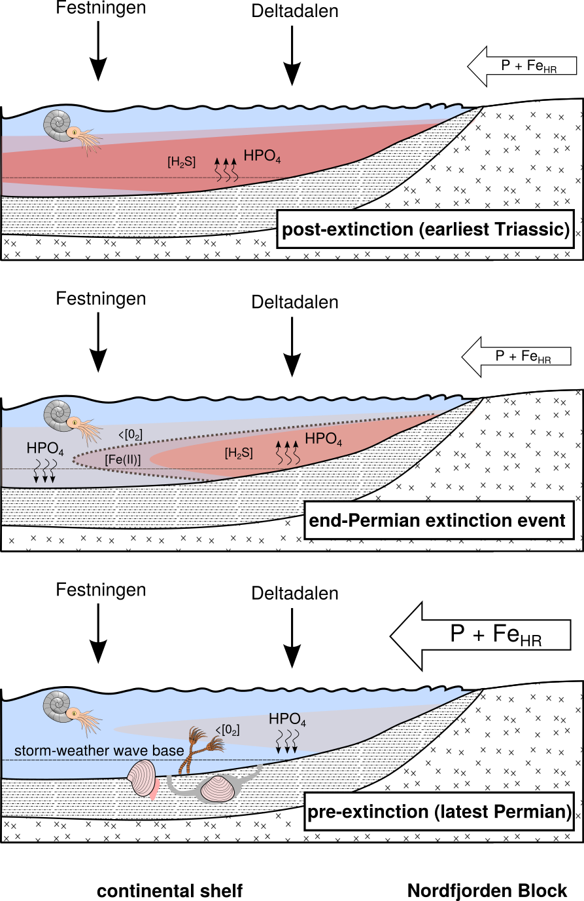

##### Page Break


```{r setup, include=FALSE}

# default knitr options
knitr::opts_chunk$set(echo = FALSE, 
                      message = FALSE, 
                      warning = FALSE, 
                      dpi = 300, 
                      digits = 2)

# following code for loading and writing the bibtex references for the used 
# packages is adapted from the blog post: //www.r-bloggers.com/bibliography-with-knitr-cite-your-references-and-packages/,
# by Michael

# required packages
packages <- c("tidyverse", # plotting, datawrangling
              "gridExtra", # multiplot
              "marelac",   # geochemical database plug-in
              "gtable",    # multiplot
              "bibtex",    # writing bibtex files
              "grid",      # drawing
              "png")    

# load packages
invisible(lapply(packages, library, character.only = TRUE))

# get the packages version 
packages_versions <- function(p) {
  paste(packageDescription(p)$Package, packageDescription(p)$Version, sep = " ")
}

# get the R reference
rref <- citation()

# create ref key
rref$key <- "rversion"

# write the R reference
write.bib(rref, "rversion.bib")

# get the packages references
write.bib(packages, "packages.bib")

# merge the mendeley references and the packages references
cat(paste("% Automatically generated", Sys.time()), "\n% DO NOT EDIT",
    { readLines("library.bib") %>% 
      paste(collapse = "\n") },
    { readLines("rversion.bib") %>% 
      paste(collapse = "\n") },
    { readLines("packages.bib") %>% 
      paste(collapse = "\n") },
    file = "biblio.bib",
    sep = "\n")

# R version has no key added
rref<- rref %>% 
  enframe() %>% 
  mutate(value = "@rversion")

data.path <- "/home/nicola/Documents/work/projects/Phosphor_project/report/spitsbergen/supplement/NatGeo/"

# load data
load(paste0(data.path, "datafiles/CD_data.Rdata")) 

```


  The Permian--Triassic (P--Tr) boundary (~251.9 million years ago[@Burgess2014]) record contains multiple signals suggestive of widespread marine anoxia, a kill mechanism widely implicated in the end-Permian mass extinction[@Wignall1996; @Cao2009; @Nabbefeld2010c; @Brennecka2011a; @Dustira2013; @Schobben2015]. The end-Permian crisis was the most dramatic turning-point in the evolution of post-Cambrian life, and as many as 81% of all marine species were lost[@Stanley2016]. Mechanisms for the globally pervasive development of oxygen-depleted oceans on timescales compatible with the duration of the extinction (~60$\,$ky[@Burgess2014]), include changes in ocean circulation[@Kiehl2005], decreased O~2~ solubility under globally rising temperatures[@Hotinski2001], and enhanced eutrophication resulting in respiratory O~2~ demand out-competing O~2~ replenishment through photosynthesis and ventilation[@Hotinski2001; @Meyer2008; @Algeo2010; @Shen2016]. In the latter case, recent studies have postulated that changes in the marine inventory of phosphorus (P)---the ultimate limiting nutrient for marine productivity on geological timescales[@Tyrrell1999]---was the main driver for eutrophication-induced oxygen depletion and ultimately the development of euxinic (H~2~S-rich) conditions in extensive regions of the global ocean[@Hotinski2001; @Meyer2008; @Shen2016].
  
  During the peak of Siberian Traps volcanism, an increase in bioavailable phosphorus would be an expected consequence of increased continental weathering via both the dissolution of exposed rock (driven by CO~2~-induced warming, and SO~2~-induced acid rain), and the disintegration of rock by mechanical forces (driven by the hydrological cycle)[@Sephton2005; @Meyer2008; @Algeo2010; @Sun2018]. Indeed, a coeval change in both lithium (Li) concentrations and Li isotope ratios has been interpreted as a pre-extinction increase in weathering[@Sun2018]. Subsequently, a change in eruption style to intrusive basalt emplacement has been linked to halocarbon remobilization and exhalations leading to ozone layer depletion and consequent terrestrial plant extirpations by UV-B irradiance[@Visscher2004; @Burgess2017]. The effects of this intrusive volcanic phase on land-plant communities have therefore been related to reduced soil stability[@Sephton2005; @Algeo2010]. Combined with continued greenhouse-induced global warming, and associated changes in the hydrological cycle, this situation likely led to a weathering-limited denudation regime of increased soil erosion and physical weathering, thereby loading near-shore environments with a higher sediment influx and terrestrial organics[@Sephton2005; @Nabbefeld2010c; @Algeo2010; @Schobben2015]
  
  Certain aspects of this scenario are problematic, as Siberian Traps activity spans a time interval of >1$\,$My, with 2/3 of the total volume of lava deposited ~0.3$\,$My before the main extinction pulse[@Burgess2017]. Furthermore, localized regions of dysoxia/anoxia occur prior to the mass extinction[@Cao2009; @Nabbefeld2010c; @Dustira2013], but there was a major expansion in the areal extent of these conditions at the extinction horizon[@Brennecka2011a; @Schobben2015]. The role of the precursor environmental changes prior to the main marine extinction crisis in pre-stressing communities is underexplored[@Algeo2012], and requires further knowledge of the mechanisms that drove the initiation of localized oxygen depletion and the ensuing global expansion of anoxic regions. 

  While an increase in the oceanic influx of bioavailable phosphorus may have occurred in association with Siberian Traps activity[@Meyer2008; @Sun2018], the catalytic effect of local redox conditions on benthic phosphorus remobilization has often been overlooked in scenarios of eutrophication-induced marine anoxia. Phosphorus is delivered to sediments in the form of organic matter and skeletal remains (biogenic apatite), as well as in association with Fe (oxyhydr)oxides and recalcitrant detrital minerals[@Froelich1979; @Krom1981; @Slomp1996; @Schenau2000]. Organically bound-P (P~org~) may be preferentially released to sediment porewaters upon microbial remineralisation, resulting in increased C~org~/P~org~ ratios in deposited sediments[@Froelich1979; @Krom1981]. In addition, the reductive dissolution of Fe (oxyhydr)oxides releases adsorbed P to solution[@Froelich1979; @Krom1981; @Slomp1996], while biogenic apatite also tends to be highly soluble[@Schenau2000]. 

  The dissolved P generated by these processes may undergo ‘sink-switching’, whereby dependent on the precise conditions, dissolved P may precipitate as either carbonate-fluorapatite (CFA)[@Ruttenberg1992] or Fe phosphates (e.g., vivianite)[@Egger2015], or may be readsorbed to Fe (oxyhydr)oxides, where such minerals persist[@Slomp1996]. However, under sulfidic conditions in particular, a significant proportion of the dissolved P generated during early diagenesis may be recycled back to the water column, thus promoting a positive productivity feedback[@Cappellen1996]. By contrast, organic-rich oxic, dysoxic and ferruginous (anoxic Fe(II)-rich) settings are potential loci of high P deposition when compared to sediments deposited under euxinic conditions. Indeed, the burial efficiency of P has been shown to behave in a systematic manner to changes in local redox conditions over geological timescales [@Algeo2007a]. These features of phosphorus cycling thus place important constraints on the bio-availability of P, and hence may ultimately control both the spread of anoxia and the generation of toxic dissolved sulfide[@Cappellen1996; @Algeo2007a;  @Meyer2008].

  Previous attempts to reconstruct phosphorus availability[@Shen2016] across the P--Tr transition have lacked a precise reconstruction of ocean redox conditions (i.e. differentiation between euxinic, ferruginous or oxic conditions), and detailed consideration of the phase partitioning of P, which are essential to evaluate the role of the P recycling feedback. To address this we apply novel sedimentary P records combined with independent redox proxies to a bathymetric transect across the P--Tr boundary. This allows evaluation of the role of redox in P recycling and the spread of anoxia during the largest mass extinction of the Phanerozoic.

## Geological setting and materials

  We investigated the Festningen and Deltadalen sequences (Svalbard), that were deposited on a shallow, open-marine shelf at the northern margin of Pangaea, facing the Boreal Sea and the Panthalassa Ocean beyond. The Kapp Starostin Formation at Festningen consists of dark, massive to bedded spiculitic chert (with minor shale) that records extensive biogenic silica production in a shelf setting[@Dustira2013]. The Kapp Starostin Formation is overlain by the shale-dominated Vardebukta Formation, and the formational contact marks the cessation of biogenic silica production. The end-Permian mass extinction is marked by a loss of intense bioturbation dominated by *Zoophycos*[@Dustira2013]. Shallow bioturbation, dominated by small *Planolites*, persists for ~3$\,$m above the formational contact, before disappearing[@Wignall1996]. 
  
  The Kapp Starostin Formation within the Deltadalen core comprises glauconitic, fine-grained sandstone with chert nodules and beds, and is interpreted to be a more proximal facies development of the unit compared to that at Festningen. This unit transitions into shaley strata towards the top, followed by a well-bedded siltstone, above which laminated shale constitutes the remainder of the sampled core. The extinction horizon is placed at the onset of the laminated shale, coincident with the disappearance of bioturbation somewhat above the base of the overlying Vikinghøgda Formation[@Nabbefeld2010c]. The basal, well-sorted sandstone of Deltadalen has been interpreted as accumulating above storm-weather wavebase[@Dustira2013; @Blomeier2013]. The P--Tr boundary is defined with the aid of $\delta$^13^C~org~ (Fig. \@ref(fig:FigStrat)) and the conodont marker species *Hindeodus parvus* (see Supplementary Information and Supplementary Figs 1-3).   


```{r}

# global plot theme
# global theme settings
theme_set(theme_classic())
theme_replace(
              plot.background   = element_rect(fill = 
                                                 "transparent", color = NA),
              panel.background  = element_rect(fill = 
                                                 "transparent", color = NA),
              legend.background = element_rect(fill = 
                                                 "transparent", color = NA),
              axis.text.x = element_text(vjust = 0.8),
              strip.background = element_rect(fill = 
                                                "transparent", color = NA),
              strip.placement = "outside")


# default ggplot color generator
ggplotColours <- function(n = 6, h = c(0, 360) + 15){
                            
                            if ((diff(h) %% 360) < 1) h[2] <- h[2] - 360 / n
                            
                            hcl(h = (seq(h[1], h[2], length = n)), 
                                c = 100, 
                                l = 65)
                          }

# plot elements: static boundaries redox conditions
# static bound anoxic and sulfidic water column

plot.els$anox <- tibble(phase = as.character(c(
                                          rep(c(bquote(Fe[HR]/Fe[tot])), 2),  
                                          rep(c(bquote(Fe[py]/Fe[HR])), 2))), 
                        value = c(0.2, 0.38, 0.7, NA), 
                        pos.x = c(0.08, 0.49, 0.6, 0.8),
                        pos.y = c(-16.7, -17, -18.5, -17),
                        text.lab = c("oxic", "anoxic", 
                                     "ferruginous", "euxinic"),
                        state = c(rep("anox", 2), "eux", NA))


# glauconite occurence
plot.els$glauc <- all.CD.long %>% 
                     filter(section == "Festningen" | 
                            section == "Deltadalen") %>% 
                     select(section, height) %>% 
                     group_by(section) %>% 
                     mutate(glauc = case_when(section == "Festningen" & 
                                                between(height, 
                                                        0, 
                                                        4.77) ~ "glauconite",
                                              section == "Deltadalen" & 
                                                height > 90 ~ "glauconite"))


# rectangle annotation function

ggplot_grad_rects <- function(n, ymin, ymax, xmin, xmax, col.f, sec, 
                              lab.ev, ypos) {
  
  y_steps <- seq(from = ymin, to = ymax, length.out = n + 1)
  alpha_steps <- seq(from = 0.5, to = 0, length.out = n)
  rect_grad <- tibble(ymin = y_steps[-(n + 1)],
                      ymax = y_steps[-1],
                      xmin = rep(xmin, n),
                      xmax = rep(xmax, n),
                      alpha = alpha_steps,
                      section = sec)
  list(geom_rect(data = rect_grad,
                  aes(xmin = xmin, 
                      xmax = xmax,
                      ymin = ymin, 
                      ymax = ymax,
                      alpha=alpha), 
                 inherit.aes = FALSE, 
                 fill = col.f) ,
  guides(alpha = FALSE),
  annotate(geom = "text", 
           x = xmin + ((xmax - xmin) / 2), 
           y = ypos , 
           label = lab.ev, 
           size = 2.5, 
           angle = 90))
  }

```


```{r FigStrat, anchor="figure", fig.width = 8 , fig.height = 8 , fig.cap = "Stratigraphic plot of  $\\delta$^13^C~org~, Fe speciation, Mo/U, Re/Mo and $\\delta$^34^S~py~ for the Festningen outcrop and Deltadalen core. The boundaries for anoxic and euxinic water column conditions were calibrated in modern and ancient aquatic environments (see text for sources). Corrected iron speciation data (Fe~py~/Fe~HR~\\*, Fe~HR~/Fe~tot~\\*) are shown as black circles; uncorrected values are shown as open circles."}

# data selection, ordering and labelling
plot.1 <- all.CD.long %>%
          filter(section == "Festningen" | section == "Deltadalen") %>%
          filter(phase == "HR_FeT" | phase == "Pyr_HR" |
                 phase == "HR_FeT_star" | phase == "Pyr_HR_star" |
                 phase == "Mo_U" |  phase == "Re_Mo") %>%
          mutate(corr = if_else(str_detect(phase, "star|Mo"), "corr",
                                "uncorr")) %>%
          mutate(phase = factor(phase, levels =c("HR_FeT",
                                                 "Pyr_HR",
                                                 "HR_FeT_star",
                                                 "Pyr_HR_star",
                                                "Mo_U", "Re_Mo"),
                                c(bquote(Fe[HR]/Fe[tot]),
                                  bquote(Fe[py]/Fe[HR]),
                                  bquote(Fe[HR]/Fe[tot]),
                                  bquote(Fe[py]/Fe[HR]),
                                  bquote(Mo/U~"(mass)"),
                                  bquote(Re/Mo~"(mass)")),
                                ordered = TRUE
                                )
                 )
  
# range set by geom blank to create equal x ranges for facets from different 
# sections          
range.1 <- plot.1 %>% 
             group_by(phase) %>% 
             mutate(value = if_else(str_detect(phase, "Fe"), 1, 
                                    max(value, na.rm = TRUE))
                    ) %>% 
              ungroup() %>% 
              group_by(section) %>% 
              mutate(value = if_else(height == min(height, na.rm = TRUE),
                                     0, value)
                     ) %>% 
             ungroup()

# Festningen                                                        
sec.select <-  "Festningen"
plot.1.f <- plot.1 %>%
              filter(section == sec.select) %>% 
              ggplot( . , aes(y = height, x = value)) +  
              geom_blank(data = range.1 %>% 
                           filter(section == sec.select), 
                         aes(y = height, x = value))  

plot.1.f_pr <- plot.1.f + 
                facet_grid(cols = vars(phase),  scales = "free", switch = "x", 
                           labeller = label_parsed) +
# adding box for equivocal area of Fe[py]/Fe[HR] on plot
                geom_rect(data = tibble(xmin = 0.2,
                                        xmax = 0.38,
                                        ymin = plot.els$y.range.f[1],
                                        ymax = plot.els$y.range.f[2],
                                        phase = factor("HR_FeT", 
                                                       levels = c("HR_FeT"),
                                                    c(bquote(Fe[HR]/Fe[tot])))),
                          aes(xmin = xmin, xmax = xmax,
                              ymin = ymin, ymax = ymax),
                          inherit.aes = FALSE, 
                          fill = "lightgrey",
                          alpha = 0.3, color = "transparent") +
                plot.els$PTX_hor_f +
                geom_vline(data = plot.els$anox, 
                           aes(xintercept = value,
                           color = state), 
                           linetype = 3, 
                           size = 0.8) +  
                geom_text(data = tibble(x = 0, 
                                        y = 10,
                                        phase = factor("HR_FeT", 
                                                       levels = c("HR_FeT"),
                                                    c(bquote(Fe[HR]/Fe[tot]))),
                                        text.lab = "equivocal"),
                          aes(x = x, 
                              y = y, 
                              label = text.lab),
                          inherit.aes = FALSE, angle = 90) +
                geom_segment(data = tibble(x = 0.1, 
                                           y = 10,
                                           xend = 0.3, 
                                           yend = 10,
                                           phase = factor("HR_FeT",
                                                       levels = c("HR_FeT"),
                                                    c(bquote(Fe[HR]/Fe[tot])))),
                            aes(x = x, 
                                y = y, 
                                xend = xend, 
                                yend = yend),
                            arrow = arrow(angle = 30, 
                                          length = unit(0.1, "cm")))+
                  geom_text(data = plot.els$anox,
                            aes(x = pos.x, 
                                y = pos.y, 
                                label = text.lab),
                                angle = 90) +
                geom_point(aes(fill = corr), shape = 21) +
                scale_fill_manual(values = c("uncorr" = "white",  
                                             "corr" = "black")) +
                scale_y_continuous(expand = expand_scale(mult = c(0,0))) + 
                plot.els$norm 
                 
# d13C
range.d13C <- c(-35, -23)
plot.d13C.f <- all.CD.long %>% 
                filter(section == sec.select) %>%
                filter(phase == "d13C") %>% 
                mutate(phase = factor(phase, levels = "d13C", 
                                      c(bquote(delta^13*C[org]~"(\u2030 VPDB)")
                                        ))) %>% 
                ggplot( . , aes(y = height, x = value)) +
                
                plot.els$PTX_hor_f +
                geom_point() +
                scale_x_continuous(limits = range.d13C, 
                                   breaks = seq(range.d13C[1], range.d13C[2], 
                                                by = 2))+
                facet_grid(cols = vars(phase),  
                           scales = "free", 
                           switch = "x", 
                           labeller = label_parsed) +
                plot.els$norm + 
                annotate("text", label= "extinction \n horizon", 
                         y = -2.5, x = -31.5 , size = 3.5) +
                annotate("text", label = "shale", y = -11.5, x = -34, 
                         size = 2.5, hjust = 0) +
                annotate("text", label = "chert", y = -17.5, x = -34, 
                         size = 2.5, hjust = 0) +
                annotate("text", label = "fine sand", y = -23.4, x = -34, 
                         size = 2.5, hjust = 0.23) 

# d34S
range.d34S<- c(-50, 10)
plot.d34S.f <- all.CD.long %>% 
                filter(section == sec.select) %>%
                filter(phase == "d34S") %>% 
                mutate(phase = factor(phase, levels = "d34S", 
                                      c(bquote(delta^34*S[py]~"(\u2030 VCDT)")
                                        ))) %>% 
                ggplot( . , aes(y = height, x = value)) +
                plot.els$PTX_hor_f +
                geom_point() +
                scale_x_continuous(limits = range.d34S, 
                                   breaks = seq(range.d34S[1], range.d34S[2], 
                                                by = 10))+
                facet_grid(cols = vars(phase),  scales = "free", switch = "x", 
                           labeller = label_parsed) +
                plot.els$norm 
                
# glauconite
range.h.f <- plot.els$glauc %>% 
              filter(section == sec.select) %>%  
              select(section, height) %>% 
              drop_na() %>% 
              summarise(min = min(height), max = max(height)) %>% 
              select( -section) %>% 
              gather() %>% 
              pull(value)

plot.gl.f <- plot.els$glauc %>% 
                drop_na() %>% 
                filter(section == sec.select) %>% 
                ggplot( . , aes(y = height, x = glauc)) + 
                geom_violin(trim = FALSE, bw = 2, fill = "#addd8e") +
                scale_y_continuous(limits = range.h.f) +
                annotate("text", label = "glauconite ", 
                         angle = 90, 
                         size = 3, 
                         x = 1, 
                         y = -10) +
                ggplot_grad_rects(25, -2, 30, -3.3, -2.2, "#67a9cf", 
                                  sec = sec.select, lab.ev = 
                                    "intrusive", 
                                  ypos = 5) +
                ggplot_grad_rects(25, -2, -25, -3.3, -2.2, "#ef8a62", 
                                  sec = sec.select, lab.ev = 
                                    "extrusive volcanism", 
                                  ypos = -15) +
                ggplot_grad_rects(25, -2, 30, -1, 0, "#d8b365", sec = 
                                    sec.select, lab.ev = 
                                    "physical weathering/transport", 
                                  ypos = 30) +
                ggplot_grad_rects(25, 2, -25, -1, 0, "#d8b365", sec = 
                                    sec.select, lab.ev = 
                                    "physical weathering/transport", 
                                  ypos = -15) +
                ggplot_grad_rects(25, -2, -25, -2.1, -1.1, "#5ab4ac", sec = 
                                    sec.select, lab.ev = 
                                    "chemical weathering", 
                                  ypos = -15) +
                ggplot_grad_rects(25, 30, -2, -2.1, -1.1, "#5ab4ac", sec = 
                                    sec.select, lab.ev = 
                                    "chemical weathering", 
                                  ypos = 50) +
                facet_grid(cols = vars(section),  scales = "free", switch = "x", 
                           labeller = label_parsed) +
                plot.els$blank +
                ggtitle(paste(sec.select, "(distal)", sep = " ")) +
                theme(axis.line.y = element_blank(),
                      axis.ticks.y = element_blank(),
                      axis.title.y = element_blank(),
                      axis.text.y = element_blank())

#Deltadalen                                                        
sec.select <-  "Deltadalen" 
plot.1.d <- plot.1 %>%
              filter(section == sec.select) %>% 
              ggplot( . , aes(y = height, x = value)) + 
              geom_blank(data = range.1 %>% filter(section == sec.select), 
                       aes(y = height, x = value)) 

plot.1.d_pr <- plot.1.d + 
                facet_grid(cols = vars(phase),  scales = "free", switch = "x", 
                           labeller = label_parsed) +
                # adding box for equivocal area of Fe[py]/Fe[HR] on plot
                geom_rect(data = tibble(xmin = 0.2, 
                                        xmax = 0.38, 
                                        ymin = plot.els$y.range.d[1],
                                        ymax = plot.els$y.range.d[2],
                                        phase = factor("HR_FeT", 
                                                       levels = c("HR_FeT"),
                                                    c(bquote(Fe[HR]/Fe[tot])))),
                          aes(xmin = xmin, 
                              xmax = xmax,
                              ymin = ymin, 
                              ymax = ymax),
                          inherit.aes = FALSE, 
                          fill = "lightgrey",
                          alpha = 0.3, color = "transparent") +
                geom_vline(data = plot.els$anox, 
                           aes(xintercept = value,
                               color = state), 
                           linetype = 3, 
                           size = 0.8) +  
                plot.els$PTX_hor_d +
                geom_point(aes(fill = corr), shape = 21) +
                scale_fill_manual(values = c("uncorr" = "white",  
                                             "corr" = "black")) +
                scale_y_reverse(expand = expand_scale(mult = c(0,0)))+
                plot.els$norm 

# d13C
plot.d13C.d <- all.CD.long %>% 
                filter(section == sec.select) %>%
                filter(phase == "d13C") %>% 
                mutate(phase = factor(phase, levels = "d13C", 
                                      c(bquote(delta^13*C[org]~"(\u2030 VPDB)")
                                        ))) %>% 
                ggplot( . , aes(y = height, x = value)) +
                plot.els$PTX_hor_d +
                geom_point() +
                scale_x_continuous(limits = range.d13C, 
                                   breaks = seq(range.d13C[1], range.d13C[2], 
                                                by = 2))+
                facet_grid(cols = vars(phase),  scales = "free", switch = "x", 
                           labeller = label_parsed) +
                scale_y_reverse()+
                plot.els$norm 

# d34S
plot.d34S.d <- all.CD.long %>% 
                filter(section == sec.select) %>%
                filter(phase == "d34S") %>% 
                mutate(phase = factor(phase, levels = "d34S", 
                                      c(bquote(delta^34*S[py]~"(\u2030 VCDT)")
                                        ))) %>% 
                ggplot( . , aes(y = height, x = value)) +
                geom_point() +
                plot.els$PTX_hor_d +
                scale_x_continuous(limits = range.d34S, 
                                   breaks = seq(range.d34S[1], range.d34S[2], 
                                                by = 10))+
                facet_grid(cols = vars(phase), scales = "free", switch = "x", 
                           labeller = label_parsed) +
                scale_y_reverse() +
                plot.els$norm 

# glauconite
range.h.d <- plot.els$glauc %>% 
              filter(section == sec.select) %>%  
              select(section, height) %>% 
              drop_na() %>% 
              summarise(min = min(height), max = max(height)) %>% 
              select( -section) %>% 
              gather() %>% 
              pull(value)

plot.gl.d <- plot.els$glauc %>% 
                drop_na() %>% 
                filter(section == sec.select) %>% 
                ggplot( . , aes(y = height, x = glauc)) + 
                geom_violin(trim = FALSE, bw = 2, fill = "#addd8e") +
                annotate("text", label = "glauconite ", 
                         angle = 90, 
                         size = 3, 
                         x = 1, 
                         y = 82) +
                ggplot_grad_rects(25, 89, 70, -3.3, -2.2, "#67a9cf", 
                                  sec = sec.select, 
                                  lab.ev = "intrusive", ypos = 85) +
                ggplot_grad_rects(45, 89, 99, -3.3, -2.2, "#ef8a62", 
                                  sec = sec.select, 
                                  lab.ev = "extrusive volcanism", ypos = 94) +
                ggplot_grad_rects(45, 86, 99, -1, 0, "#d8b365", 
                                  sec = sec.select, 
                                  lab.ev = "physical weathering/transport", 
                                  ypos = 65) +
                ggplot_grad_rects(25, 89, 70, -1, 0, "#d8b365", 
                                  sec = sec.select, 
                                  lab.ev = "physical weathering/transport", 
                                  ypos = 94) +
                ggplot_grad_rects(45, 89, 99, -2.1, -1.1, "#5ab4ac", 
                                  sec = sec.select, 
                                  lab.ev = "chemical weathering", ypos = 65) +
                ggplot_grad_rects(25, 70, 89, -2.1, -1.1, "#5ab4ac", 
                                  sec = sec.select, 
                                  lab.ev = "chemical weathering", ypos = 94) +
                scale_y_reverse(limits = rev(range.h.d)) +

                facet_grid(cols = vars(section),  scales = "free", switch = "x", 
                           labeller = label_parsed) +
                plot.els$blank +
                ggtitle(paste(sec.select, "(proximal)", sep = " ")) +
                theme(axis.line.y = element_blank(),
                      axis.ticks.y = element_blank(),
                      axis.title.y = element_blank(),
                      axis.text.y = element_blank())

# Remove clipping panel from grobs with section name annotate
pg.fest$layout$clip[pg.fest$layout$name == "panel"] <- "off"
pg.DD$layout$clip[pg.DD$layout$name == "panel"] <- "off"

# change width of glauconite plots
plot.gl.f <- ggplotGrob(plot.gl.f)
plot.gl.d <- ggplotGrob(plot.gl.d)
plot.gl.f$widths[j.plot] <- 0.5 * sum(plot.gl.f$widths[j.plot])
plot.gl.d$widths[j.plot] <- 0.5 * sum(plot.gl.d$widths[j.plot])

# add litho key to first plot
cf <- ggplotGrob(plot.d13C.f)
key <- readPNG(paste0(data.path, "data/litho/litho_key.png"))
litho_key <- rasterGrob(key, 
                        height = unit(0.5, "npc"), 
                        width= unit(0.5, "npc"),  
                        x = unit(0.2,"npc"),  
                        y = unit(0.2,"npc"))
cf <- gtable_add_grob(x = cf, grobs = litho_key, t = 7, l = 5)
# Remove clipping panel from grobs with section name annotate
cf$layout$clip[cf$layout$name == "panel"] <- "off"

# ensuring same sized plot heights
fest <- cbind(pg.fest,
              plot.gl.f,
              cf,
              ggplotGrob(plot.1.f_pr), 
              ggplotGrob(plot.d34S.f), size = "first")
DD   <- cbind(pg.DD,
              plot.gl.d,
              ggplotGrob(plot.d13C.d),
              ggplotGrob(plot.1.d_pr), 
              ggplotGrob(plot.d34S.d), size = "first")

# combine plots
str_plots <- grid.arrange(DD, fest, ncol = 1)

# save plots external
ggsave(paste0(data.path, "figures/Fig1.tiff"), 
       str_plots , height = 20, width = 23, unit = "cm")

```


## Local redox chemistry 

  The redox-sensitivity of phosphorus burial makes it imperative to obtain a precise assessment of the redox chemistry of the water column. To achieve this we combined iron speciation analyses with redox-sensitive trace element concentrations (see Methods), allowing oxic, dysoxic, anoxic ferruginous, and euxinic water column conditions to be differentiated[@Poulton2005; @Algeo2009]. The Fe speciation method relies on the quantification of operationally-defined Fe fractions that are considered highly reactive (Fe~HR~) towards dissolved sulfide on early diagenetic timescales[@Raiswell1998; @Poulton2002]. The proportion of Fe~HR~ relative to total iron (Fe~tot~) has been extensively calibrated in modern and ancient settings, such that Fe~HR~/Fe~tot~ >0.38 indicates an anoxic water column, values below 0.22 commonly indicate oxic depositional conditions, and values of 0.22--0.38 are considered equivocal[@Poulton2011]. We then use the extent of pyritisation of Fe~HR~ to differentiate euxinic (Fe~py~/Fe~HR~ >0.7--0.8) from ferruginous water column conditions (Fe~py~/Fe~HR~ <0.7)[@Poulton2011]. 

  Non-sulfidized Fe~HR~ has the potential to be converted to less reactive sheet silicate minerals (termed poorly reactive sheet silicate Fe; Fe~PRS~) during early diagenesis and deeper burial[@Poulton2002; @Lyons2006; @Poulton2010]. Depletion of Fe~HR~ by this mechanism is clearly observed in some of the studied samples, and is marked by the co-occurrence of glauconite at both localities. Glauconite occurs as fibroradiated precipitates covering quartz grains and shell fragments, suggesting an authigenic precipitate rather than a late diagenetic replacement product or detrital source (Fig. \@ref(fig:FigStrat) and Supplementary Discussion and Supplementary Figs. 4 and 7), and thus Fe~HR~ minerals would have been the primary source. To compensate for this transfer of Fe~HR~ to glauconite, we apply a correction to samples that show clear enrichment in Fe~PRS~ over background values, yielding estimates (Fe~HR~/Fe~tot~\*, Fe~py~/Fe~HR~\*) of initial depositional ratios.  
  
  The distinctive geochemical behaviour of molybdenum (Mo), uranium (U) and rhenium (Re) provides further insight into water column redox conditions. High sediment Mo accumulation tends to occur when water column concentrations of sulfide are high, and likely relates to the formation of particle-reactive thiomolybdates[@Algeo2009]. By contrast, U may be fixed in the sediment under anoxic porewater conditions, without the requirement for free H~2~S, and Re may be sequestered under dysoxic conditions in the water column and sediments, where O~2~ penetrates <1$\,$cm below the sediment--water interface[@Kendall2010; @Algeo2009]. Therefore, high Re/Mo ratios tend to indicate dysoxic water column conditions[@Kendall2010], whereas enhanced Mo/U ratios are suggestive of a euxinic water column[@Algeo2009].
  
  The pre-extinction sandstone of the proximal Deltadalen locality is conspicuous for its authigenic glauconite content. Glauconite formation is favoured by elevated concentrations of Fe~HR~, silica and potassium under dysoxic conditions[@Chafetz2000; @Peters2012]. High Re/Mo ratios across this interval (Fig. \@ref(fig:FigStrat))[@Kendall2010] coupled with the ichnoassemblage and the impoverished shelly faunal record, which consists of the inarticulate brachiopod *Lingularia freboldi*[@Manwell1960; @Peng2007] (see Supplementary Discussion and Supplementary Figs. 5 and 6), is consistent with prevailing dysoxic seafloor conditions. This brachiopod has lophophoral cavities significantly larger than is usual for lingulids, which has been related to reduced oxygen availability[@Peng2007]. Thus, the elevated Fe~HR~/Fe~tot~\* values of the Kapp Starostin Formation (Fig. \@ref(fig:FigStrat)) likely reflect the production of a high proportion of Fe (oxyhydr)oxides during enhanced weathering[@Poulton2002], rather than anoxic, water column conditions. 
  
  Enrichments in Re begin to decrease below the extinction interval at Deltadalen, coincident with increasing Mo/U ratios (Fig. \@ref(fig:FigStrat)). These high ratios coincide with the enhanced fixation of Fe~HR~ as pyrite (Fig. \@ref(fig:FigStrat)), Mo~EF~--U~EF~ that approach those observed in modern euxinic settings (Fig. \@ref(fig:FigCross)), and the disappearance of burrowing (Supplementary Fig. 3), suggesting the development of dominantly euxinic conditions in the water column in proximal settings at the extinction boundary and into the Early Triassic[@Algeo2009; @Poulton2011] 


```{r FigCross,  anchor="figure", fig.width = 8, fig.height = 3, fig.cap = "Crossplots of Mo--U covariation. a-b) Mo and U are given as enrichment factors (EF = [element/Al]~sample~/[element/Al]~AV~, where AV represents average shale[@Wedepohl1991]). The dashed lines represent seawater (sw) Mo--U mass ratios for modern environments; high (sulfidic Cariaco Basin), moderate (non-sulfidic open marine), and low (restricted, sulfidic Black Sea)[@Algeo2009]. c) Conceptual model of enrichment patterns and changes in sedimentary Mo~EF~ and U~EF~ in relation to hydrographic and redox conditions [adapted from Ref. @Algeo2009], Note, that the dashed line  sketches the trajectory of the open marine conditions of Deltadalen from dysoxic (low Mo--high U) to euxinic (high Mo--low U)."}

# data selection, ordering and labelling
plot.2 <- all.CD.long %>% 
          filter(section == "Festningen" | section == "Deltadalen") %>% 
          filter(phase == "Mo_EF" | phase == "U_EF") %>% 
          mutate(section = if_else(section == "Festningen", "b) Festningen (distal)", 
                                   "a) Deltadalen (proximal)")) %>% 
          spread(phase, value) %>% 
            left_join(. , all.CD.long %>% 
                          filter(section == "Festningen" | 
                                   section == "Deltadalen") %>%
                          filter(phase == "Pyr_HR_star") %>% 
                          mutate(phase = factor(phase, levels = "Pyr_HR_star", 
                                                              "c) Model"
                                                                    )) %>% 
                          select(RD = phase, section.ID, valueRD = value),
                      by = "section.ID") 

max.range <- max(plot.2$U_EF, na.rm = TRUE) * 1.1

# coefficient based on molar ratio of 7.5 (Algeo & Tribovillard 2009)
SW <- function(x){with(atomicweight, (Mo * 7.5 / U )) * x}  
MOU.df <- tibble(U_EF = seq(0.1, max.range, 0.1)) %>% 
              mutate(Mo_EF_1 = SW(U_EF), 
                     Mo_EF_9 = SW(U_EF) * 10,
                     Mo_EF_0.1 = SW(U_EF) * 0.1) %>% 
              gather("key", "Mo_EF", -U_EF)

MOE.text <- tibble(section = rep("b) Festningen (distal)", 3),
                   labels = c(bquote("0.1"~Mo/U[sw]),
                              bquote(Mo/U[sw]),  
                              bquote("10"~Mo/U[sw])),
                   x.pos = c(10, 8, 1),
                   y.pos = c(5, 37, 43))

plot.2.d <- plot.2 %>%
              ggplot( . , aes(y = Mo_EF, x = U_EF)) 
  
plot.2.d_pr <- plot.2.d +
                facet_grid(cols = vars(section)) +
                geom_line(data = MOU.df, aes(y = Mo_EF, 
                                             x = U_EF, 
                                             group = key),
                          linetype = 2) +
                geom_point(aes(color = valueRD)) +
                coord_trans(x= 'log10',y = 'log10') + 
                annotate("text", 
                         label = as.character(expression(Fe[py]/Fe[HR])), 
                         y = 2.5,  
                         x = 45,  
                         size = 3,  
                         parse = TRUE) +
                geom_text(data = MOE.text, aes(y = y.pos, x = x.pos, 
                                               label = labels), 
                          angle = 27, parse = TRUE, size = 3) +
                scale_y_continuous(breaks = c(0.1,1, 10, 100)) +
                scale_x_continuous(limits = c(0.1, max.range), 
                                   breaks = c(0.1,1, 10)) +
                labs(color = expression(Fe[py]/Fe[HR])) +
                scale_fill_continuous(limits =c(0, 1), 
                                      breaks = seq(0, 1, 0.1)) +
                theme(axis.text = element_text(size=9),
                      legend.position = c(0.95, 0.22),
                      legend.background = element_blank(),
                      legend.key.size = unit(0.3, units = "cm"),
                      legend.text = element_text(size = 6),
                      legend.title = element_text(size = 7)) +
                xlab(expression(U[EF])) +
                ylab(expression(Mo[EF]))
  
plot.2.d_b <- plot.2.d +
                geom_blank() +
                facet_grid(cols = vars(RD)) +
                ylab(expression(Mo[EF]))+
                xlab(expression(U[EF]))+
                geom_line(data = MOU.df, aes(y = Mo_EF, 
                                             x = U_EF, 
                                             group = key)) +
                coord_trans(x= 'log10',y = 'log10') +
                scale_y_continuous(breaks = c(0.1,1, 10, 100)) +
                scale_x_continuous(limits = c(0.1, max.range), 
                                 breaks = c(0.1,1, 10)) +
                theme(axis.ticks = element_blank(),
                      axis.text.y = element_text(size=9,  color="white"),
                      axis.title.y = element_text(size=10,  vjust = -3.5),
                      panel.background = element_rect(fill="#f0f0f0"))


pg   <-  ggplotGrob(plot.2.d_b)
p.t  <-  (gtable_filter(pg, "panel", trim = FALSE))$layout$t
p.l  <-  (gtable_filter(pg, "panel", trim = FALSE))$layout$l

pg.Grobs <- list() # empty list

# grobs
pg.Grobs$circ.1 <- grid.circle(x = unit(0.2, "npc"), 
                                 y = unit(0.7, "npc"),  
                                 r = unit(0.12, "npc"), 
                                 gp = gpar(fill = "#99d8c9"), 
                                 draw = FALSE)
pg.Grobs$arrow.1 <- grid.lines(x = unit(c(0.05, 0.17), "npc"), 
                                y = unit(c(0.05, 0.55), "npc"), 
                                gp = gpar(col = "red", fill = "red", lwd = 3),  
                                arrow = arrow(length = unit(0.03, "npc"), 
                                              ends="last", type="closed"), 
                                draw = FALSE) 
pg.Grobs$text.1  <- grid.text(label = "weakly\n restricted\n basin", 
                               x = unit(0.2, "npc"), 
                               y = unit(0.7, "npc"), 
                               gp = gpar(fontsize = 6), 
                               draw = FALSE)
pg.Grobs$rect.1  <- grid.rect(width = unit(0.15, "npc"), 
                               height=unit(0.1, "npc"),  
                               x = unit(0.15, "npc"), 
                               y = unit(0.35, "npc"), 
                               gp = gpar(fill = "#f0f0f0", 
                                         col = "#f0f0f0"), 
                               draw = FALSE)
pg.Grobs$text.2  <- grid.text(label = "paticulate\n shuttle", 
                               x = unit(0.12, "npc"), 
                               y = unit(0.35, "npc"), 
                               gp = gpar(col = "red", 
                                         fontsize = 6), 
                               draw = FALSE)
pg.Grobs$arrow.2 <- grid.lines(x = unit(c(0.05, 0.3), "npc"), 
                                y = unit(c(0.05, 0.05), "npc"), 
                                gp = gpar(col = "red", fill = "red", lwd = 3),  
                                arrow = arrow(length = unit(0.03, "npc"), 
                                              ends= "last", type= "closed"), 
                                draw = FALSE) 
pg.Grobs$text.3 <-grid.text(label = "dysoxic", 
                               x = unit(0.5, "npc"), 
                               y = unit(0.05, "npc"), 
                               gp = gpar(fontface= "italic", 
                                         fontsize=5), 
                               draw = FALSE)
pg.Grobs$arrow.3 <- grid.lines(x = unit(c(0.3, 0.3 + 
                                             (0.47 * ((0.17 - 0.05) / 
                                                        (0.55 - 0.05)))), "npc"), 
                                y = unit(c(0.05, 0.52), "npc"), 
                                gp = gpar(col = "red", 
                                          fill = "red", 
                                          lwd = 3),  
                                arrow = arrow(length = unit(0.03, "npc"), 
                                              ends = "last", 
                                              type = "closed"), 
                                draw = FALSE) 
pg.Grobs$circ.2 <-  grid.circle(x = unit(0.45, "npc"), 
                                y = unit(0.65, "npc"), 
                                r = unit(0.12, "npc"), 
                                gp = gpar(fill = "#99d8c9"), 
                                draw = FALSE)
pg.Grobs$text.4  <-  grid.text(label = "open \n marine", 
                               x = unit(0.45, "npc"), 
                               y = unit(0.65, "npc"), 
                               gp = gpar(fontsize = 6), 
                               draw = FALSE)
pg.Grobs$text.6  <-  grid.text(label = "sulfidic", 
                               x = unit(0.31, "npc"), 
                               y = unit(0.55, "npc"), 
                               gp = gpar(fontface = "italic", 
                                         fontsize = 5), 
                               draw = FALSE)
pg.Grobs$text.8  <-  grid.text(label = "redox\n variation", 
                               x = unit(0.65, "npc"), 
                               y = unit(0.26, "npc"),  
                               gp = gpar(col = "red", 
                                         fontsize = 6), 
                               draw = FALSE)
pg.Grobs$arrow.5 <-  curveGrob(x1 = 0.3, 
                               x2 = 0.25, 
                               y1 = 0.05, 
                               y2 = 0.45, 
                               curvature = 1,  
                               ncp = 8, 
                               square = FALSE, 
                               inflect = FALSE, 
                               gp = gpar(col = "red", 
                                         fill = "red", 
                                         lwd = 3, 
                                         lty = 2),  
                               arrow = arrow(length = unit(0.03, "npc"), 
                                             ends = "last", 
                                             type = "closed"))

# adding grobs
for(i in seq_along(pg.Grobs)){
  
  pg <- gtable_add_grob(x = pg, grob = pg.Grobs[[i]], t = p.t, l = p.l, 
                        z = Inf, name = names(pg.Grobs)[i])
  
}

cr_plots <- grid.arrange(plot.2.d_pr, pg, nrow = 1, widths = c(2/3, 1/3)) 
                  
ggsave("figures/Fig2.tiff", cr_plots, height = 7, width = 20, unit = "cm")

```


  The sponge spiculite chert of the Kapp Starostin Formation at Festningen (distal site) is marked by Fe~HR~/Fe~tot~\* values in the equivocal zone, as well as low Mo/U and generally low Re/Mo (Fig. \@ref(fig:FigStrat)). These vast sponge meadows are consistent with a well-oxygenated water column[@Blomeier2013], whereas infrequent peaks in Re/Mo may indicate occasional dysoxic conditions. A pronounced peak in non-sulfidized iron, coincident with enrichments in Fe~HR~, the precipitation of glauconite, muted Re/Mo enrichments, and lower bioturbation intensity (see Supplementary Fig. 3), occurs at the extinction horizon in the basal Vardebukta Formation (Fig. \@ref(fig:FigStrat)), suggesting the development of dysoxic and/or ferruginous conditions in the overlying water column. Enrichments in Fe~HR~ persist across the P--Tr boundary at ~5$\,$m above the base of the Vardebukta Formation, with elevated  Fe~py~/Fe~HR~\*, moderate enrichments in Mo relative to U (Fig. \@ref(fig:FigStrat)), the cessation of bioturbation (Supplementary Fig. 3), and Mo~EF~--U~EF~ that are comparable to normal oxic marine settings (Fig. \@ref(fig:FigCross)). Together, this implies the probable development of euxinic conditions in the water column, but relatively low levels of Mo drawdown imply either intermittent or weakly sulfidic conditions in this more distal setting[@Scott2012].
   
  The spatio-temporal variability in water column redox implies the existence of dysoxic conditions on the shallow shelf prior to the extinction horizon (Fig. \@ref(fig:FigStrat)). Subsequently, at the extinction horizon, euxinic conditions developed on the shallower shelf (Deltadalen), and dysoxic to ferruginous conditions expanded into more distal deeper shelf settings (Festningen). This was followed by the expansion of anoxia across the shelf, specifically with euxinic conditions becoming more widespread (at least intermittently) in the post-extinction Early Triassic. The S isotope composition of pyrite provides additional support for this redox reconstruction. Generally light and quite variable pyrite  $\delta$^34^S values (`r round(all.CD.long %>% filter(section == "Festningen" & phase == "d34S" & height < 0) %>%  summarise(av  = mean(value)) %>% pull(av), 1)` ± `r round(all.CD.long %>% filter(section == "Festningen" & phase == "d34S" & height < 0) %>%  summarise(sd  = sd(value)) %>% pull(sd), 1)`‰) prior to the extinction horizon at the more distal locality (Fig. \@ref(fig:FigStrat)) are consistent with low rates of microbial sulfate reduction in sediments deposited beneath an oxic water column[@Lyons1997]. By contrast, heavier $\delta$^34^S~py~ where glauconite is prevalent, both in the lower section of the more proximal locality (`r round(all.CD.long %>% filter(section == "Deltadalen" & phase == "d34S" & height > 87) %>% drop_na() %>%  summarise(av  = mean(value)) %>% pull(av), 1)` ± `r round(all.CD.long %>% filter(section == "Deltadalen" & phase == "d34S" & height > 87) %>% drop_na() %>%  summarise(sd  = sd(value)) %>% pull(sd), 1)`‰)  and just above the extinction horizon at the more distal locality (`r round(all.CD.long %>% filter(section == "Festningen" & phase == "d34S" , between(height, 0, 3)) %>%  summarise(av  = mean(value)) %>% pull(av), 1)` ± `r round(all.CD.long %>% filter(section == "Festningen" & phase == "d34S" , between(height, 0, 3)) %>%  summarise(sd  = sd(value)) %>% pull(sd), 1)`‰), suggests more complete consumption of sulfate, possibly linked to temporal and spatial variability in sulfate concentrations across the transect. Particularly in the case of the distal glauconite-rich horizon, relatively heavy $\delta$^34^S~py~ may be due to significant drawdown of the continental sulfate flux under euxinic conditions on the more proximal shelf. However, under euxinic conditions at both sites, $\delta$^34^S~py~ values cluster around a narrow range (`r round(bind_rows(all.CD.long %>% filter(section == "Deltadalen" & phase == "d34S" & height < 86) %>% drop_na(), all.CD.long %>% filter(section == "Festningen" & phase == "d34S" & height > 5)) %>%  summarise(av  = mean(value)) %>% pull(av), 1)` ± `r round(bind_rows(all.CD.long %>% filter(section == "Deltadalen" & phase == "d34S" & height < 86) %>% drop_na(), all.CD.long %>% filter(section == "Festningen" & phase == "d34S" & height > 5)) %>%  summarise(sd  = sd(value)) %>% pull(sd), 1)`‰), which is entirely consistent with the narrow range commonly found in modern and ancient euxinic settings[@Lyons1997; @Shen2002].
  
  We use our phosphorus data to test two scenarios that are compatible with environmental change at the extinction horizon and our independent proxy data. Firstly, the Fe~HR~ flux from the continent may have dropped (as recorded by a decrease in glauconite at Deltadalen; Fig. \@ref(fig:FigStrat)) proportional to the sulfate influx with the switch to deforestation, soil erosion and increased physical weathering[@Sephton2005; @Algeo2010; @Sun2018]. Alternatively, an increase in organic carbon (C~org~) availability (Fig. \@ref(fig:FigPhos)) under eutrophic conditions on the shelf may have increased the production of H~2~S, thus overwhelming the continental supply of Fe~HR~. Both of these scenarios would initially promote enhanced production of sulfide on the more proximal continental shelf, the significance of which we consider in more detail below. 
  

```{r FigPhos,  anchor="figure", fig.width = 5.5, fig.height = 5.5, fig.cap = "Stratigraphic distribution of  P~tot~/Al, C~org~, C~org~/P~org~, and C~org~/P~reac~ ratios. The threshold of P~tot~/Al (mass ratio) is the average shale reference value[@Wedepohl1991], whereas the C/P molar ratio of 106/1 denotes the Redfield ratio, and the red circle represents an outlier (P~tot~/Al > 2.0)."}

# data selection, ordering 
plot.3 <- all.CD.long %>% 
            filter(section == "Festningen" | section == "Deltadalen") %>% 
            filter(phase == "P_Al" | 
                   phase == "TOC" | 
                   phase == "Corg_Porg" |  
                   phase == "Corg_Preac") %>% 
            mutate(value = if_else(phase == "Corg_Porg", value / 100, value))

# store outlier of P/Al (2.0)
plot.3.out <- all.CD.long %>%
                filter(phase == "P_Al" & value > 1.5)  

# filter-out outlier of P/Al (2.0)
plot.3 <- setdiff(plot.3, plot.3.out)

# change outlier value to fit plot window but store the value in text.lab
plot.3.out <- plot.3.out %>% 
              mutate(text.lab = paste0(">(", sprintf("%.1f", value) ,")")) %>% 
              mutate(value = 0.6) 
              
# labelling
plot.3 <- plot.3 %>% 
            mutate(phase = factor(phase,
                                  levels = c("P_Al", 
                                             "TOC",
                                             "Corg_Porg",
                                             "Corg_Preac"
                                             ),
                                            c(bquote(P[tot]/Al~"(mass)"),
                                            bquote(C[org]~"(wt \u0025)"),
                                            expression(paste(C[org]/P[org], 
                                                       "\n \u00d7", 
                                                       10^2, 
                                                       " (molar)")),
                                            bquote(C[org]/P[reac]~"(molar)")
                                             ),
                                  ordered = TRUE
                                )
                   ) 

plot.3.out <- plot.3.out %>% 
                mutate(phase = 
                         factor(phase, 
                                levels = "P_Al",
                                c(bquote(P[tot]/Al~"(mass)"))))


# range set by geom blank to create equal x ranges for facets from different 
# sections          
range.3 <- plot.3 %>% 
           group_by(phase) %>% 
           mutate(value = max(value, na.rm = TRUE)) %>% 
           group_by(section) %>% 
           mutate(value = if_else(height == min(height, na.rm = TRUE),
                                  0, value)) %>% 
           ungroup()

# P static bounds
plot.els$P.bounds <- tibble(phase = factor(c("P_Al", 
                                             "TOC",
                                             "Corg_Porg",
                                             "Corg_Preac"), 
                                           levels = 
                                             c("P_Al", 
                                               "TOC",
                                               "Corg_Porg",
                                               "Corg_Preac"),
                                           c(bquote(P[tot]/Al~"(mass)"),
                                             bquote(C[org]~"(wt \u0025)"),
                                             expression(paste(C[org]/P[org], 
                                                              "\n \u00d7", 
                                                              10^2, 
                                                              " (molar)")),
                                             bquote(C[org]/P[reac]~"(molar)")
                                            ),
                                           ordered = TRUE),
                            value = c(ls.Chem$PAAS %>% 
                                        filter(phase == "P_Al") %>%  
                                        pull(value), NA, 1.06, 106),
                            state = c("PAAS", 
                                      NA, 
                                      "Redfield", 
                                      "Redfield"),
                            text.lab = c("average shale", 
                                         rep(NA, 2), 
                                         "Redfield"),
                            pos.x = c(0.07, rep(NA, 2), 130),
                            pos.y = c(95, rep(NA, 2), 95))

# Festningen                                                        
sec.select <-  "Festningen"
plot.3.f <- plot.3 %>%
              filter(section == sec.select) %>% 
              ggplot( . , aes(y = height, x = value)) +  
              geom_blank(data = range.3 %>% filter(section == sec.select), 
                         aes(y = height, x = value))  

plot.3.f_pr <- plot.3.f + 
                plot.els$PTX_hor_f +
                geom_vline(data = plot.els$P.bounds, aes(xintercept = value,
                                                     color = state),
                           linetype = 3, size = 0.8) +
                geom_point() +
                facet_grid(cols = vars(phase),  scales = "free", switch = "x", 
                           labeller = label_parsed) +
                ggtitle(paste(sec.select, "(distal)", sep = " ")) +
                plot.els$norm +
                theme(title = element_text(size = 8))

# schematic for redox conditions

height <- seq(plot.els$y.range.f[1], plot.els$y.range.f[2], 3)

redox.f  <- tibble(height = height, volc = rep(0, length(height))) %>% 
              mutate(redox = 
                      if_else(between(height, -2, max(height)), 
                               case_when(between(height,  0, 4) ~ 1,
                                     between(height,  4, max(height)) ~  2),
                                                                          0))  

redox.f <- spline(x = redox.f$height, y = redox.f$redox, n = 1000) %>%
                as_tibble() %>% 
                mutate(section = "Festningen") %>% 
                ggplot(. , aes(y = x, x = 0, fill = y)) + 
                geom_tile() +
                annotate("rect", 
                         ymin = min(redox.f$height), 
                         ymax = max(redox.f$height), 
                         xmin = -0.5, 
                         xmax = 0.5,
                         fill = "transparent", 
                         color = "black") +
                
                scale_y_continuous(expand = expand_scale(mult = c(0,0))) +
                scale_fill_gradient(name = NULL, high = "#132B43", 
                                    low = "#56B1F7", breaks = c(0,1,2), 
                                    labels=c("oxic","ferruginous", "euxinic"),  
                                    guide = guide_colorbar(
                                      direction = "horizontal", 
                                      label.position = "top", 
                                      label.theme = element_text(size = 6, 
                                                                 angle = 45), 
                                      ticks.colour = "black", 
                                      ticks.linewidth = 1, 
                                      frame.colour = "black", 
                                      frame.linewidth = 1)) +
                facet_grid(cols = vars(section),  scales = "free", switch = "x", 
                            labeller = label_parsed) +
                plot.els$blank +
                theme(legend.position = c(-3, 1.1),
                      axis.line.x = element_line(color = "black"),
                      axis.ticks.x = element_blank(),
                      
                      legend.key.size = unit(0.2,"cm"),
                      axis.line.y = element_blank(),
                      axis.ticks.y = element_blank(),
                      axis.title.y = element_blank(),
                      axis.text.y = element_blank(),
                      legend.text.align = 0)

                 
# Deltadalen                                                       
sec.select <-  "Deltadalen"
plot.3.d <- plot.3 %>%
              filter(section == sec.select) %>% 
              ggplot( . , aes(y = height, x = value)) +  
              geom_blank(data = range.3 %>% filter(section == sec.select), 
                         aes(y = height, x = value))  

plot.3.d_pr <- plot.3.d + 
                plot.els$PTX_hor_d +
                geom_vline(data = plot.els$P.bounds, aes(xintercept = value,
                                                     color = state),
                           linetype = 3, size = 0.8) +
                geom_text(data = plot.els$P.bounds, aes(x = pos.x, y = pos.y,
                                                        label = text.lab),
                          angle = 90, size = 3) +
                geom_text(data = plot.3.out, aes(y = height, 
                                                 x = value * 0.72,
                                                 label = text.lab),
                          size = 2.5) +
                geom_point() +
                geom_point(data = plot.3.out, aes(y = height, x = value),
                           color = "red")+
                facet_grid(cols = vars(phase),  scales = "free", switch = "x", 
                           labeller = label_parsed) +
                ggtitle(paste(sec.select, "(proximal)", sep = " ")) +
                scale_y_reverse() +
                plot.els$norm +
                theme(title = element_text(size = 8))

# schematic for redox conditions

height <- seq(plot.els$y.range.d[1], plot.els$y.range.d[2], length.out = 10)

redox.d  <- tibble(height = height, volc = rep(0.5, length(height))) %>% 
              mutate(redox = if_else(height < 87, 2, 0.5)) %>% 
              drop_na()
                                                                          
redox.d <- spline(x = redox.d$height, y = redox.d$redox, n = 1000) %>%
                as_tibble() %>% 
                mutate(section = "Deltadalen") %>% 
                ggplot(. , aes(y = x, x = 0, fill = y)) + 
                
                geom_tile() +
                annotate("rect", 
                         ymin = min(redox.d$height), 
                         ymax = max(redox.d$height), 
                         xmin = -0.6, 
                         xmax = 0.6,
                         fill = "transparent", 
                         color = "black") +
                scale_fill_gradient(name = NULL, high = "#132B43", 
                                    low = "#56B1F7", breaks = c(0,1,2), 
                                    labels = c("oxic","ferruginous","sulfidic"),  
                                    guide = guide_colorbar(
                                      direction = "horizontal", 
                                      label.position = "top", 
                                      label.theme = element_text(size = 6, 
                                                                 angle = 45))) +
                scale_y_reverse(expand = expand_scale(mult = c(0,0))) +
                facet_grid(cols = vars(section),  scales = "free", switch = "x", 
                            labeller = label_parsed) +
                plot.els$blank +
                theme(legend.position = "none",
                      axis.line.y = element_blank(),
                      axis.line.x = element_line(color = "black"),
                      axis.ticks.x = element_blank(),
                      axis.ticks.y = element_blank(),
                      axis.title.y = element_blank(),
                      axis.text.y = element_blank(),
                      legend.text.align = 0)

r.f <- ggplotGrob(redox.f)
r.f$widths <- r.f$widths * 0.1

r.d <- ggplotGrob(redox.d)
r.d$widths <- r.d$widths * 0.1
                 
# ensuring same sized plot heights
fest <- cbind(pg.fest, ggplotGrob(plot.3.f_pr), r.f, size = "first")
DD   <- cbind(pg.DD, ggplotGrob(plot.3.d_pr), r.d, size = "first")

# combine plots
str_plots <- grid.arrange(DD, fest, nrow = 2)

# save plots external
ggsave(paste0(data.path, "figures/Fig3.tiff"), 
       str_plots , height = 14, width = 14, unit = "cm")

```


## Phosphorus recycling and the spread of anoxia

  To assess the potential role of phosphorus in driving our proposed redox structure we quantified different phosphorus-bearing phases (see Methods), specifically Fe (oxyhydr)oxide-bound P (P~Fe~), biogenic and authigenic apatite (P~aut~), organic-P (P~org~), and crystalline detrital phases (P~det~)[@Ruttenberg1992]. While detrital P is generally considered unreactive in the water column and during early diagenesis, the remaining phases comprise a ‘reactive’ P pool (P~reac~). However, Fe(III)-rich sheet silicates (such as glauconite) can also effectively trap phosphate[@Borgnino2009], which is extracted as part of the P~det~ pool (see Supplementary Discussion and Supplementary Fig. 8). 
  
  Prior to the extinction horizon at the proximal Deltadalen locality, P~tot~/Al is considerably enriched relative to average marine shale (Fig. \@ref(fig:FigPhos)). This suggests an effective drawdown mechanism from a water column that was rich in phosphate. Furthermore, although preferential release from organic matter occurred during diagenesis (C~org~/P~org~ > the molar Redfield ratio of 106/1), low C~org~/P~reac~ ratios (<< 106/1) combined with high P~tot~/Al, suggest effective sequestration of P in the sediment, with no evidence for recycling back to the water column. To explain these observations we invoke a high initial weathering influx of phosphate to the proximal shelf associated with initial emplacement of the Siberian Traps prior to the main extinction pulse[@Burgess2017], which enhanced productivity and C~org~ remineralisation in the water column, leading to the development of dysoxic conditions  (Fig. \@ref(fig:FigConcept)). However, the extent and intensity of deoxygenation was limited by effective drawdown of P to the sediments in association with both organic matter and the high weathering influx of Fe (oxyhydr)oxide minerals. Subsequent ‘sink switching’ resulted in the ultimate retention of P in the sediment, largely in association with CFA and glauconite (see Supplementary Discussion and Supplementary Fig. 8).

  These factors then controlled the geochemistry of the distal, pre-extinction Festningen locality, where P~tot~/Al ratios are close to average shale, C~org~/P~org~ ratios are elevated relative to the Redfield ratio, and C~org~/P~reac~ ratios scatter close to the Redfield ratio (Fig. \@ref(fig:FigPhos)). This suggests that the high initial weathering influx of P was efficiently sequestered in more proximal settings (giving lower  P~tot~/Al in distal settings), thus limiting the spatial extent of dysoxic conditions. Furthermore, while P was released from organic matter during microbial respiration (C~org~/P~org~ > 106/1), there is little evidence for a high sustained flux back to the water column (C~org~/P~reac~ ratios fall close to the Redfield ratio), consistent with the expected behaviour of P in sediments deposited beneath an oxic water column[@Cappellen1996; @Algeo2007a]. 

  At the extinction horizon, P~tot~/Al ratios decrease to average shale values at the proximal Deltadalen locality, and both C~org~/P~org~ and C~org~/P~reac~ ratios increase considerably to values that exceed the Redfield ratio (Fig. \@ref(fig:FigPhos)).This suggests that the development of euxinia fuelled efficient release of P from both organic matter and Fe (oxyhydr)oxides, and a positive productivity feedback was promoted via recycling of a significant proportion of the released phosphate back to the water column. The initial driver of euxinia is more difficult to ascertain, but was likely related to the change to a weathering-limited denudation regime (Fig. \@ref(fig:FigStrat)), thereby decreasing the land-derived influx of Fe~HR~ (consistent with the loss of glauconite at Deltadalen). This led to a tipping point whereby a relative excess of dissolved sulfate over Fe~HR~ promoted the development of euxinia[@Poulton2011]. As discussed above, an increase in eutrophication driven by an enhanced nutrient influx may also have promoted sulfide production. However, this seems a less likely explanation for the initial driver of euxinia given the fact that nutrient inputs were apparently already high (Fig. \@ref(fig:FigPhos)).  

  In glauconite-rich sediments immediately above the extinction horizon at the distal Festningen locality, there is an initial peak in P~tot~/Al in association with the development of dysoxic and/or ferruginous conditions. Here, our detailed P speciation analyses suggest that, as with the glauconite-rich horizon in the proximal locality, P was trapped in the sediment in association with CFA and glauconite (see Supplementary Discussion and Supplementary Fig. 8). The high P content of this horizon likely occurred due to drawdown of P that was recycled under euxinic conditions in more proximal settings, suggesting the operation of a redox-controlled nutrient shuttle across the shelf. This nutrient shuttle then drove the development of marine euxinia to its maximum extent in the aftermath of the mass extinction (Fig. \@ref(fig:FigConcept)), where wind- and density-driven water circulation on the shelf would support upward transport of recycled P, and thus sustained deoxygenation[@Meyer2008]. At Festningen, however, the development of only weak or intermittent euxinia after the P--Tr boundary restricted the extent of P recycling to the water column (C~org~/P~reac~ scatters around the Redfield ratio; Fig.  \@ref(fig:FigPhos)), which effectively constrained the maximum spatial extent of euxinia.


```{r FigConcept,  anchor="figure", fig.cap = "Conceptual model of the development of water column redox conditions. In the Late Permian, the inner shelf was dysoxic and large amounts of reactive P accumulated. During the end-Permian mass extinction euxinia developed on the inner shelf, whereas the outer shelf environment became dysoxic/ferruginous. Under these conditions, P was remobilized from the inner shelf, invigorating productivity (and thus oxygen depletion), and dissolved P was recycled to the outer shelf and initially deposited through uptake by Fe (oxyhydr)oxide particles settling on the seabed. After the extinction, euxinic conditions became more prevalent across the shelf, which was initiated and maintained by recycling of P."}



```


## Implications for extinction selectivity 
This P-driven biogeochemical cascade is synchronous with independent proxy records for the global-scale spread of anoxic water masses[@Brennecka2011a; @Schobben2015], and it was this that initiated the main marine extinction pulse. The P-driven control on the extent of initial deoxygenation and subsequent euxinia promoted life-viable environments in the deep marine realm, thereby shaping the ecosystems of the surviving biota. Based on the benthos that survived the end-Permian mass extinction at Deltadalen, a planktotrophic larval stage[@Foster2017] (see Supplementary discussion) and a high-tolerance to low-oxygen conditions seem important traits. These benthic species could rapidly disperse over large distances, thus increasing the chance of survival in habitable locations.

In accordance with theoretical ecological models[@Barnosky2012], environmental deterioration of the marine realm began before the extinction pulse. The initial development of dysoxic/anoxic water masses, which were preferentially situated in shallow marine environments in the Boreal region[@Algeo2012], may thus be regarded as a prelude to the impending mass extinction. Our redox model also resolves the apparent conflict between the timing of magmatic activity[@Burgess2017], enhanced weathering[@Sun2018], and the main extinction pulse. The sum of these changes in marine redox conditions across large stretches of the shelf, which harboured the majority of the Palaeozoic biodiversity[@Wignall1996], appears to have been detrimental to many life forms at the end of the Permian.


### Methods

**Organic carbon content and carbon isotopes.** Carbonate was removed by treating the sample with 2 M HCl. The residues were repeatedly washed with MilliQ water^TM^and dried at 40$\,$°C. The de-carbonated samples were analyzed for total organic carbon (TOC = C~org~) content and associated carbon isotopic composition using an Elementar Pyrocube elemental analyser linked to an Isoprime mass spectrometer following a standard protocol. Details regarding the reproducibility of the carbon isotope measurements and an extended protocol are included in the Supplementary Methods.

**Bulk element content.** Whole rock major- (Fe, P, Al) and minor (Mo, U, Re) elements where obtained by dissolving ashed samples (550$\,$°C over night) with HNO~3~–HF–HClO~4~ followed by inductively coupled plasma optical emission spectrometry (ICP-OES). The accuracy of elemental analysis was monitored by analyzing certified standards, and repeated measurement yielded RSDs that are better than 5$\,$% for all elements (Supplementary Methods and Supplementary Table 1).

**Sequential Fe and P extractions.** A standard sequential Fe extraction was followed[@Poulton2005]. A sodium acetate solution at pH 4.5 for 48$\,$h at 50$\,$°C was used to extract Fe~carb~, followed by a 2 h, room temperature extraction with sodium dithionite solution at pH 4.8 to obtain Fe~ox~. An extraction with ammonium oxalate for 6$\,$h at room temperature  was then applied to yield Fe~mag~. Iron from poorly reactive sheet silicates (Fe~PRS~) was dissolved using concentrated, boiling HCl for 1 min[@Poulton2005]. Iron concentrations in the extraction solutions were measured via atomic absorption spectrometry (AAS). Phosphorus phases were extracted via a revised SEDEX scheme for ancient rocks[@Ruttenberg1992; @Thompson2019]. P~Fe1~ (poorly crystalline Fe (oxyhydr)oxides) was extracted with a sodium dithionite solution (buffered with bicarbonate to pH of 7.6) for 8$\,$h at room temperature; P~aut~ was extracted with a sodium acetate solution at pH 4 for 6$\,$h at room temperature; P~det~ was extracted with a 10$\,$% HCl solution for 16$\,$h at room temperature; P~mag~ was extracted with an ammonium oxalate solution for 6$\,$h at room temperature; P~Fe2~ (more crystalline Fe (oxyhydr)oxides) was extracted with a sodium dithionite solution (buffered with citrate to a pH of 4.8) for 8$\,$h at room temperature, and, finally the residue was ashed (550$\,$°C for 2$\,$h) and reacted with 10$\,$% HCl solution for 16$\,$h at room temperature to liberate P~org~. The sum of P~Fe1~ + P~Fe2~ + P~mag~ gives P~Fe~. The P content of the various extracts was determined either via the molybdate blue method[@Ruttenberg1992] or ICP-OES (in the case of P~Fe1~, P~Fe2~ and P~mag~). The precision of the various Fe and P phase measurements as well as the extended protocols are reported in the Supplementary Methods and Supplementary Tables 2 and 3.

**Pyrite content and sulfur isotopes.** Pyrite S was measured via the chromium reduction method[@Canfield1986]. This method liberates H~2~S, which is subsequently trapped as silver-sulfide (Ag~2~S). Pyrite iron was determined stochiometrically from the weight of the Ag~2~S recovered. The Ag~2~S was analysed for S isotope composition using an Elementar Pyrocube linked to an Isoprime mass spectrometer (see the Supplementary Methods for reproducibility of S isotope measurements and an extended protocol). 


## Acknowledgements
MS was funded by a DFG Research Fellowship (SCHO 1689/1--1). SWP acknowledges support from a Royal Society Wolfson Research Merit Award and a Leverhulme Research Fellowship. DPGB acknowledges funding from the Natural Environment Research Council (NE/J01799X/1). HHS and SP acknowledge support from the Norwegian Research Council by Centres of Excellence funding to CEED (project number 223272), and Lundin Petroleum, Arctic Drilling AS and Store Norske Spitsbergen Kulkompani for funding, drilling, and support related to the Deltadalen core.

## Author contributions
The study was designed by MS, RJN, PBW and SWP. Samples were collected by VZ, ARNS, HS, SP, PBW, and DPGB. Palaeontological data acquisition was performed by WJF, PBW, and DPGB. Geochemical analyses were performed by MS, FM and RJN. MS and SWP interpreted data. MS led the writing of the manuscript with contributions from all co-authors.

## Competing interests
The authors declare no competing interests.

## Data and Code Availability

Both raw and processed geochemical data are provided as an online supplement (Zenodo: <https://doi.org/xxx>). The Rmarkdown files can be used to reproduce the data analysis as well as generating the accompanying data figures and the main and supplementary information texts.

## References
